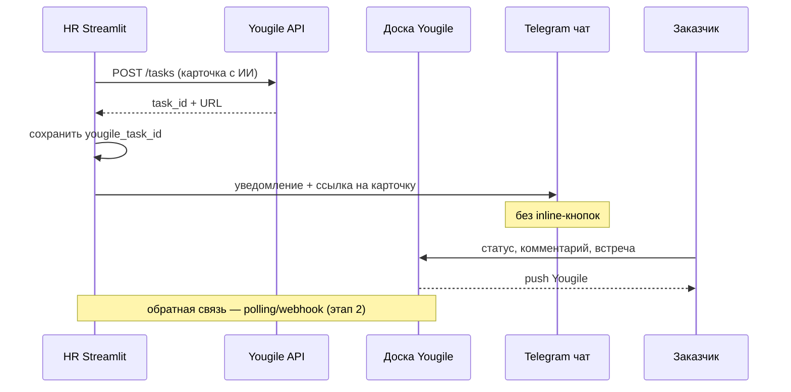
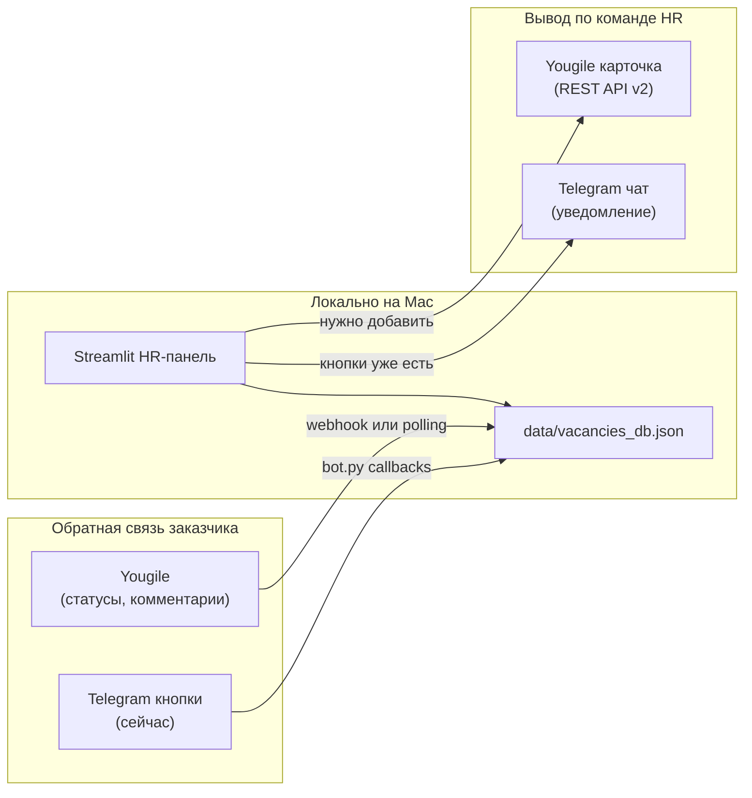

# Журнал аудитов и улучшений — hr_ai_agent

Цель: накопить контекст по приложению, зафиксировать находки и в конце сформировать вывод о целесообразности текущего стека + альтернативы с учётом планируемого расширения функционала.

**Статус:** 🔄 в процессе → **решение: сценарий B + Timeweb** (2026-06-24)  
**Приоритет:** безопасность → mobile UI → deep links → деплой  
**Начало:** 2026-06-24  
**Метод:** A статика → B запуск → C UI в браузере → D Telegram → E итоговый вывод по стеку

### Прогресс этапов

| Этап | Статус | Примечание |
|------|--------|------------|
| A — Статический аудит кода | ✅ сессия 1 | 2026-06-24 |
| B — Локальные данные / окружение | ✅ сессия 2 | Mac M1, `.env`+`data/` есть |
| B — Запуск Streamlit/bot | ⏳ | venv не в репо; нужен запуск на Mac пользователя |
| C — UI в браузере | ✅ сессия 5 | HR + client zone (Маркетинг), mobile 390px |
| D — Telegram vs Yougile | 🔄 | гипотеза: ссылка вместо кнопок; A/B тест в отдельной ветке |
| E — Итог: стек + Yougile + альтернативы | 🔄 | добавлен сценарий C (мобильная client zone) |
| F — Аналитика / мульти-клиент / расширения | 📝 | требования зафиксированы, реализация — позже |

---

## Контекст приложения (живая справка)

| Аспект | Текущее состояние |
|--------|-------------------|
| Назначение | HR-подбор: вакансии, воронка кандидатов, ИИ-оценка резюме, клиентская зона, Telegram-бот |
| Режим работы | **Только локально** на MacBook M1; на сервер **не задеплоено** |
| UI | Streamlit (`hri_full_v1.py`, `pages/client.py`, `pages/master.py`) |
| Бот | aiogram (`bot.py` + telegram_* модули) |
| Данные | JSON-файлы в `data/` (vacancies, departments, chats) |
| ИИ | RouterAI / OpenAI-compatible API (Qwen), `resume_ai.py` |
| Интеграции | Telegram, Google Calendar, Yandex S3/SpeechKit |
| Деплой | Docker Compose подготовлен, но **не используется** в проде |
| Клиентские зоны | Тестовые, доступа нет; **возможен отказ** |
| Авторизация UI | Нет (для локального режима — приемлемо; при выходе в сеть — нет) |

## 2026-06-24 — Фаза 1: безопасность (реализовано)

**Тип:** `feature` · **security**

### Модель доступа (по решению заказчика)
- **Client zone / master:** без пароля; секретный токен в URL (`?t=…`, 32+ символов)
- **HR-панель:** пароль через `HR_APP_PASSWORD` (если пуст — без пароля, локальная разработка)
- **Устаревший `?dept=`** — отключён
- **Бот:** только Mac+VPN; не пишет в базу; напоминания читают **локальный** `data/` (см. риск ниже)

### Сделано
- `client_access.py` — токены отделов в `departments.json`, мастер-токен в `data/zone_access.json` или `MASTER_ZONE_ACCESS_TOKEN`
- `hr_auth.py` — вход в HR-панель
- `pages/client.py`, `pages/master.py` — проверка токена
- `hri_full_v1.py` — HR login, ссылки с токенами, блок «Ссылки клиентских зон» в Настройках
- `.env.example` — `HR_APP_PASSWORD`, `PUBLIC_APP_BASE_URL`

### Файлы
`client_access.py`, `hr_auth.py`, `pages/client.py`, `pages/master.py`, `hri_full_v1.py`, `.env.example`, `data/departments.json`, `data/zone_access.json`

### Риски / открыто
- **Напоминания бота на Mac** после деплоя: локальный `data/` ≠ сервер → нужен **pull с Timeweb** (rsync) или отключить напоминания до sync
- **«Отправить в чат» с Timeweb:** API Telegram с VPS может не работать → отправка с Mac или прокси (фаза 3–4)
- **HTTPS** на Timeweb — при деплое (nginx/Caddy)
- **Перезапуск Streamlit** нужен для применения изменений

### Следующий шаг
- Фаза 3: деплой Timeweb, `PUBLIC_APP_BASE_URL`, sync `data/` Mac↔сервер

---

## 2026-06-24 — Фаза 2: mobile UI + deep links (реализовано)

**Тип:** `feature` · **UX**

### Сделано
- **Client zone:** mobile CSS (`@media max-width: 768px`), блок профиля вакансии, портфолио и HR-коммент в карточке, авто-раскрытие кандидата по `candidate_id`
- **Deep links:** `/client?t=…&vacancy_id=…&candidate_id=…` — выбор вакансии и фокус на карточке
- **Telegram (сценарий B):** «Отправить в общий чат» — **без inline-кнопок**, в сообщении ссылка на карточку в client zone (`PUBLIC_APP_BASE_URL`)
- **HR:** mobile CSS в `corporate_ui.py` (колонки в столбик, кнопки на всю ширину); в карточке кандидата — копируемая ссылка на client zone
- **Master zone:** блок профиля вакансии перед списком кандидатов

### Файлы
`client_access.py`, `client_zone.py`, `pages/client.py`, `pages/master.py`, `telegram_client.py`, `corporate_ui.py`, `candidate_funnel.py`, `hri_full_v1.py`

### Риски / открыто
- Без `PUBLIC_APP_BASE_URL` ссылка в TG будет относительной или с предупреждением
- **Перезапуск Streamlit** нужен для проверки в браузере
- Напоминания бота и sync `data/` — фаза 3–4

### Следующий шаг
- Перезапустить Streamlit и проверить deep link + mobile 390px
- Фаза 3: Timeweb deploy

---

### Фаза 2 — Mobile UI (черновик → ✅ реализовано)

| Решение | Детали |
|---------|--------|
| **Основной сценарий** | **B — Client zone** (ссылка в TG вместо кнопок) |
| **Деплой** | **Timeweb** — Streamlit (`hr-app`), **без бота на сервере** |
| **Бот** | **Только на Mac** + VPN (напоминания HR, отправка в TG) |
| **Yougile** | Отложить / A-B позже |
| **Обязательно до прода** | **Безопасность** (auth client zone + HR) |
| **Обязательно** | **Mobile UI** — client zone + HR-панель (желательно все функции) |

### Целевая архитектура (зафиксировано)

```
[Timeweb VPS]                    [Mac + VPN]
 Streamlit 24/7                   bot.py (напоминания)
 ├── HR-панель (mobile)           telegram_notify (отправка в чат)
 └── Client zone (mobile)              │
        ▲                              │
        └──── ссылка в TG ─────────────┘
              (с Mac при отправке)
```

**Данные:** `data/` на Timeweb (volume). Mac-бот читает/пишет тот же `data/` только если синхронизировать — **нужно решить** (см. дорожную карту).

### Дорожная карта (что дальше)

| Фаза | Содержание | Зависимости |
|------|------------|-------------|
| **0. Согласование** | План ниже, порядок фаз | сейчас |
| **1. Безопасность** 🔴 | Auth HR + client zone; HTTPS; секреты; изоляция `data/` | до открытия URL |
| **2. Mobile UI** 🟡 | Responsive CSS; client zone deep links; HR на телефоне | фаза 1 частично |
| **3. Telegram-ссылка** 🟡 | Сообщение без кнопок + URL на карточку; профиль/портфолио/HR-коммент в client zone | фаза 2 |
| **4. Деплой Timeweb** | Только `hr-app`; без `hr-bot`; инструкция sync `data/` Mac↔сервер | фазы 1–3 |
| **5. Аналитика** 🟢 | Архив, периоды, поиск (отдельная вкладка) | после стабильного прода |
| **6. Пристройки** 🟢 | KPI, договоры — модуль `vacancy_hr_docs` | по запросу |

### Фаза 1 — Безопасность (черновик требований)

| Риск | Сейчас | Цель |
|------|--------|------|
| Client zone без пароля | `?dept=Маркетинг` = доступ | Пароль/токен per отдел или общий + роли |
| HR-панель без пароля | Любой с URL | Логин HR (Streamlit auth / basic auth nginx) |
| `data/` на сервере | JSON с ПДн кандидатов | HTTPS, бэкапы, не в git |
| Секреты | `.env` | Только на сервере; `ROUTERAI` на сервере если ИИ с VPS |
| CSRF / session | Streamlit defaults | Оценить при выборе auth |

**Открытый вопрос:** один пароль на всё или отдельные доступы HR vs заказчик per `dept`?

### Фаза 2 — Mobile UI (черновик)

| Зона | Приоритет | Действия |
|------|-----------|----------|
| Client zone | P0 | `@media`, deep link, профиль вакансии, портфолио, HR-коммент |
| HR: воронка кандидатов | P0 | Компактные карточки, меньше колонок на узком экране |
| HR: выбор вакансии | P1 | Список вместо сетки 3 колонки |
| HR: документы / ИИ | P1 | Вкладки, прокрутка |
| HR: настройки | P2 | Редко на мобилке |

### Фаза 3–4 — Данные Mac + сервер

**Проблема:** бот на Mac и Streamlit на Timeweb не могут писать в один `vacancies_db.json` без синхронизации.

| Вариант | Описание |
|---------|----------|
| **A. Сервер — источник истины** | HR работает через Timeweb (в т.ч. с телефона); Mac-бот тянет `data/` по rsync/scp по расписанию или webhook |
| **B. Только уведомления с Mac** | Бот не пишет в базу; только шлёт TG; все правки — на сервере |
| **C. SQLite на сервере** | Один API/файл; позже |

**Рекомендация:** **A или B** на старте — уточнить, меняет ли HR статусы через бота или только через веб.

---

> HR-рабочая зона остаётся **локально на MacBook**.  
> Вывод **по команде HR**:
> 1. **Yougile** — основной интерфейс заказчика (карточка на доске, пуши Yougile).
> 2. **Telegram** — пока дубль (уведомление + ссылка на карточку Yougile); **под вопросом** после тестов (есть пуши Yougile).
>
> **Вместо кнопок в Telegram** — прямая **ссылка на доску/карточку** кандидата в Yougile.  
> Заказчик делает всё в карточке (статус, комментарии, встреча).
>
> Тестирование — **отдельная версия приложения** + **тестовый чат Telegram**.

### Требования к карточке Yougile (от заказчика)

| Блок | Содержимое | Поля в `vacancies_db.json` |
|------|------------|----------------------------|
| Заголовок | ФИО + вакансия | `name`, `vacancy.title` |
| Резюме | Ссылка | `resume_link`, `hh_resume_link` |
| Видео | Запись собеседования | `video_link` |
| Портфолио | Если включено для вакансии | `portfolio_link`, `vacancy.show_portfolio_field` |
| Задание | Только если давалось и выполнено | `task_link` (не пустой) |
| ИИ-оценка | Балл, комментарий, сильные/слабые стороны | `ai_score`, `ai_comment`, `ai_strengths`, `ai_weaknesses`, `ai_profile_requirements_met` |
| Комментарий HR | Текст рекрутера | `hr_comment` |

**Формат:** HTML в `description` (Yougile API v2). Сейчас в Telegram ИИ-оценка **не попадает** — нужен новый билдер `build_yougile_card_description()`.

### Стратегия Telegram (пока теория, нужен A/B тест)

| Сейчас | Целевое (гипотеза) |
|--------|-------------------|
| Сообщение + inline-кнопки статусов | Короткое уведомление + **ссылка на Yougile** |
| `bot.py` обрабатывает callbacks | Бот **не нужен** для заказчика (если без кнопок) |
| Дубль каналов TG + Yougile | После теста — возможно **только Yougile** |

**Влияние на приоритеты аудита:**
- 🟢 Client zone Streamlit — не развивать
- 🟡 `bot.py` + `telegram_workflow` + handlers — **кандидаты на упрощение/удаление** после успешного теста Yougile
- 🟡 **Новый фокус:** Yougile API, билдер карточки с ИИ, ссылка в TG, тестовая ветка
- 🟢 Docker/VPS — отложено

---

## Сводка находок (обновляется)

| Приоритет | Кол-во | Категории |
|-----------|--------|-----------|
| 🔴 Критично | 1 | дублирование миграций (A-02) |
| 🟡 Важно | 20 | UI/UX client zone, deep links, статистика, мобилка |
| 🟢 Желательно | 12 | HR-навигация, Streamlit Deploy, портфолио в client zone |

---

## Записи аудита

<!-- Новые записи добавляются сверху (свежие — первыми) -->

---

## Сравнение сценариев: канал для заказчика (индекс)

> Три версии для A/B тестирования. Общее: HR локально; Telegram — уведомления HR + (опционально) пинг заказчику со **ссылкой** вместо inline-кнопок.

| Критерий | **A. Yougile** | **B. Мобильная client zone** | **C. Гибрид** |
|----------|----------------|------------------------------|---------------|
| Интерфейс заказчика | Доска Yougile | Streamlit `/client?…` | Yougile + client zone на выбор |
| Ссылка в Telegram | URL карточки Yougile | URL карточки кандидата в client zone | Обе или по настройке вакансии |
| ИИ-оценка у заказчика | В `description` карточки (HTML) | `render_ai_evaluation_block` — **уже есть** | Дублировать билдер |
| Профиль должности | Вручную / вложение | **`vacancy.documents.profile`** — **сейчас не показан** в client zone | Нужно добавить в оба канала |
| Портфолио | В HTML карточки | **Нет** в compact summary (только resume/video/task) | Доработать client zone |
| Аудио/видео | Одна ссылка `video_link` | То же — **отдельного поля audio нет** | Универсальная «Запись» |
| Комментарий клиента | В Yougile | `client_comment` + кнопка «Сохранить» — **есть** | |
| Обратная связь в HR | Вручную + **уведомление HR** о смене | Автоматически в JSON при сохранении | |
| Push заказчику | Push Yougile | Нет (только TG-ссылка) | Оба |
| Зависимость от `bot.py` | Только отправка + напоминания HR | То же | То же |
| Локальный Mac | Polling/webhook для Yougile | Streamlit должен быть **доступен по сети** для мобилки заказчика | |
| Auth | Yougile-аккаунт | **Нет** (URL = доступ) — риск при публикации | |
| Мульти-клиент | Доски/колонки per client | `departments` + `client_id` — **уже в модели** | |

**Рекомендация аудита:** тестировать **A и B параллельно** на тестовом чате; не умножать приложение на клиентов — использовать `client_id` / отделы в одном инстансе.

---

## 2026-06-24 — Решение: сценарий B + Timeweb + security + mobile

**Тип:** `decision`

**Принято:**
- Основной путь: **Client zone (B)** на **Timeweb**, бот **только Mac+VPN**.
- Приоритеты: **безопасность** → **mobile UI** (HR + client) → TG-ссылки → деплой.
- Yougile — отложен.

**Открыто:**
- Синхронизация `data/` Mac↔сервер для бота.
- Модель auth: один пароль vs per-dept.

**Следующий шаг:** Фаза 1 — бриф по безопасности и выбор схемы auth (ждём «ок»).

---

## 2026-06-24 — Этап C: UI-аудит в браузере (сессия 5)

**Тип:** `audit` · **Этап:** C  
**URL:** `http://127.0.0.1:8501` (локальный Streamlit на Mac)

### Проверено
- HR-панель: вкладка «Вакансии», открытие «Графический дизайнер» (39 кандидатов)
- Client zone: `/client?dept=Маркетинг` → вакансия «Графический дизайнер» → 4 кандидата в зоне заказчика
- Client zone: `/client?dept=Тестировочный` → пусто (нет активных вакансий на dept 99)
- Mobile viewport: 390×844 (iPhone-подобный) через CDP

### HR-панель — находки UI

| ID | Находка | Приоритет |
|----|---------|-----------|
| UI-01 | **3 уровня вкладок** (Вакансии → в работе/шаблоны/создание → кандидаты/документы/статистика) — много кликов | 🟢 |
| UI-02 | Вакансия с 39 кандидатами — **тяжёлая страница** (DOM ~4900 строк snapshot) | 🟡 |
| UI-03 | Кнопка **«Deploy»** Streamlit видна — для локального режима отвлекает | 🟢 |
| UI-04 | Сайдбар HR: ссылки на все client zones — удобно для HR, не для заказчика | ✅ ок |
| UI-05 | Подвкладка **«Статистика»** — только воронка текущей вакансии, нет периодов/архива/клиентов | 🟡 (см. F-01) |

### Client zone — находки UI (сценарий B)

| ID | Находка | Приоритет |
|----|---------|-----------|
| UI-06 | **ИИ-оценка полная** в expander: балл, %, сильные/слабые — **лучше чем Telegram** | ✅ сильная сторона |
| UI-07 | Ссылки: резюме, запись, задание — **есть**; **портфолио нет**; **профиль вакансии нет** | 🟡 |
| UI-08 | **Нет deep link** — URL только `?dept=…`; вакансию выбирают вручную в selectbox | 🟡 |
| UI-09 | **2 шага** до кандидатов: открыть зону → выбрать вакансию | 🟡 |
| UI-10 | **Нет комментария HR** в карточке заказчика (только client_comment) | 🟡 |
| UI-11 | Кнопка **«Сохранить»** на каждом кандидате — хорошо; подсказка внизу есть | ✅ |
| UI-12 | Статусы + встреча (дата/время/офис/удалённо) — **работает** для «Встреча» | ✅ |
| UI-13 | **Тестировочный** dept в сайдбаре HR ведёт на пустую зону — путает при тестах | 🟢 |
| UI-14 | Нет кнопки «назад» / брендинга — голая страница | 🟢 |

### Mobile (390px) — предварительный вердикт сценария B

| Аспект | Оценка | Комментарий |
|--------|--------|-------------|
| Список кандидатов | 🟡 | Длинные ФИО + статус + дата — **читается**, но строка перегружена |
| Selectbox вакансии | ✅ | На всю ширину, нормально |
| Развёрнутая карточка | 🟡 | Много полей + вложенный expander ИИ — **длинный скролл** |
| Кнопки-ссылки (резюме) | ✅ | Компактные синие кнопки |
| Date picker встречи | 🟡 | Streamlit calendar на мобилке — **нужен тест пальцем** (не кликали) |
| `layout="wide"` | 🟡 | На мобилке не ломает, но не оптимизировано |

**Предварительный вывод по сценарию B:** client zone **пригодна как база**, но для мобильного заказчика нужны: deep link, профиль вакансии, портфолио, HR-комментарий, mobile-first CSS, сокращение шагов (vacancy из URL).

### Сравнение A vs B после UI-теста

| Критерий | Yougile (A) | Client zone (B) |
|----------|-------------|-----------------|
| ИИ-оценка у заказчика | Нужно строить | **Уже есть** |
| Мобильный UX | Нативное приложение | Streamlit — **с доработками** |
| Deep link | URL карточки API | **Нужно добавить** |
| Профиль должности | В description | **Нужно добавить** |
| Обратная связь в HR | Вручную + уведомление | **Авто при «Сохранить»** |
| Доступ с телефона заказчика | Yougile cloud | **Mac должен быть доступен в сети** |

### Следующий шаг
- Этап D: тест TG «уведомление + ссылка» (без кнопок) в тестовом чате
- Прототип deep link: `/client?dept=…&vacancy_id=…&candidate_id=…`

---

## 2026-06-24 — Сценарий B (client zone) + аналитика + бот (сессия 4)

**Тип:** `audit` · `decision` · **Этап:** H, D, F

### Новый сценарий от заказчика (проиндексирован)

**B. Мобильная client zone** — если Streamlit-зона удобна на телефоне:
- В Telegram — **ссылка на карточку кандидата** (не кнопки статусов).
- В карточке: резюме, запись (видео/аудио через `video_link`), портфолио, задание, комментарий HR, **поле комментария клиента**, ИИ-оценка.
- На уровне вакансии — **зона/ссылка на профиль должности** (`documents.profile`).

### Индекс текущей client zone (код)

| Компонент | Файл | Что есть | Gap vs требования |
|-----------|------|----------|-------------------|
| Точка входа | `pages/client.py` | `?dept=Имя`, выбор вакансии | ❌ нет `vacancy_id`, `candidate_id` в URL |
| Карточка | `client_zone.py` | Статус, ссылки, ИИ-блок, комментарий, встреча, «Сохранить» | ❌ нет портфолио в summary; ❌ нет профиля вакансии |
| Стили | `client_zone.py` | Компактные кнопки-ссылки | ❌ нет `@media` mobile; `layout="wide"` |
| Мастер-зона | `pages/master.py` | Сводка руководителя | Не для заказчика |
| Логика статусов | `client_actions.py` | Синхронизация с `hr_stage` | ✅ переиспользуется |
| Deep link | — | **Отсутствует** | Нужно: `/client?dept=X&vacancy_id=…&candidate_id=…` |

**Целевой deep link (черновик):**
```
/client?dept=Маркетинг&vacancy_id=<uuid>&candidate_id=<uuid>
```
→ открыть expander нужного кандидата, прокрутка к карточке.

### Ответы заказчика (зафиксировано)

| Вопрос | Ответ |
|--------|-------|
| Статусы из Yougile в HR | Можно вручную; нужно **уведомление HR**: клиент зашёл / были изменения / напоминание проверить |
| Напоминания HR в Telegram | **Нужны** |
| Нужен ли бот для отправки в чат? | См. раздел «Бот: что нужно запускать» ниже |

### Бот: что нужно запускать (важное понимание)

```
┌─────────────────────────────────────────────────────────────┐
│  TELEGRAM_BOT_TOKEN — «паспорт» бота. Один токен.           │
└─────────────────────────────────────────────────────────────┘
         │                              │
         ▼                              ▼
  ОТПРАВКА (исходящие)            ПРИЁМ (входящие)
  ────────────────────            ─────────────────
  HTTP POST api.telegram.org      Процесс bot.py
  из Streamlit (telegram_notify)  long polling
                                  │
  • «Отправить в чат»             • inline-кнопки (если останутся)
  • уведомление + ссылка          • /commands, callbacks
  • bot.py НЕ нужен               • цикл напоминаний HR ← ВАЖНО
                                  • bot.py ОБЯЗАТЕЛЕН
```

| Действие | Нужен запущенный `bot.py`? | Как работает |
|----------|---------------------------|--------------|
| HR жмёт «Отправить в чат» / уведомление со ссылкой | **Нет** | `telegram_notify.send_telegram_html()` → HTTP API |
| Заказчик жмёт кнопку в сообщении | **Да** | callback → `telegram_bot_handlers` |
| Автонапоминания HR (собеседование, «проверь статус») | **Да** | `reminder_loop()` в `bot.py`, интервал ~15 мин |
| Уведомление «изменилось в Yougile» (будущее) | **Нет*** | Можно слать из HR-приложения тем же HTTP API |
| Digest по расписанию | **Да** (сейчас) | `telegram_reminders.collect_scheduled_digest_jobs` в цикле бота |

\* *Если сделать отдельный локальный cron/скрипт с тем же токеном — тоже без polling, но сейчас напоминания вшиты в бота.*

**Итог для тебя:** для сценария «только ссылка в чат» бот **не нужен для отправки**, но **нужен для напоминаний HR** — пока их логика в `bot.py`. Альтернатива: вынести `reminder_loop` в отдельный лёгкий процесс.

### Требования: аналитика и база (зафиксировано)

| Требование | Сейчас | Gap |
|------------|--------|-----|
| Статистика по месяцам/годам | `vacancy_stats` — только **текущая** вакансия; `master_stats` — активные | ❌ нет timeline, нет архива по периодам |
| Разбивка по клиентам | `client_id` + `departments.json` | ❌ нет UI аналитики по клиентам |
| Поиск архивных вакансий | Архив есть (`active: false`, `closed_at`) | ❌ нет поиска/фильтра в UI |
| Поиск кандидатов | — | ❌ нет глобального поиска |
| ИИ-справки по базе | ИИ только per-candidate (резюме) | ❌ нет RAG/поиска по всей базе |
| Сравнение вакансий | — | ❌ |
| Пристройки (KPI, договоры…) | `vacancy.documents` — profile, vacancy_text… | 🟡 расширяемая модель, но монолит `hri_full_v1` |

### Мульти-клиент: одно приложение vs копии

| Подход | Плюсы | Минусы |
|--------|-------|--------|
| **Одно приложение** (`client_id` на вакансии) | Уже в коде; одна база; сквозная аналитика | Нужна аккуратная фильтрация; бэкап целиком |
| **Копия app + `data/` per клиент** | Изоляция | Дубли кода; нет сквозной аналитики; больше поддержки |

**Рекомендация:** **одно приложение**, при росте — уровень «клиент» (`client_id` / юрлицо) поверх `departments`, отдельные Yougile-доски и TG-чаты per client. Умножать репозиторий — только при жёсткой изоляции данных.

### Архитектура данных для поиска и ИИ-аналитики (черновик)

```
Сейчас:  vacancies_db.json (1.2 МБ, всё в одном файле)
         ↓ при росте
Этап 1:  SQLite (вакансии, кандидаты, этапы, full-text по резюме-тексту)
Этап 2:  Индекс для ИИ-запросов (resume_text, transcript, hr_comment, ai_comment)
Этап 3:  Плагин-модули: analytics/, documents_hr/ (KPI, договоры) — отдельные вкладки
```

JSON оставить как экспорт/бэкап; рабочий слой — SQLite для поиска и не ломать текущий save-flow через адаптер.

### Пристройки без поломки текущей версии (паттерн)

Уже работает для: `candidate_funnel`, `vacancy_prep`, `vacancy_stats` — **отдельные модули + вкладка/подзона**.

Для блока «HR-документы» (KPI, адаптация, договоры):
- новый `vacancy_hr_docs.py` + подвкладка в карточке вакансии
- данные: `vacancy.hr_documents` или `data/documents/<vacancy_id>/`
- не трогать `candidate_funnel` и Telegram-flow

### Находки сессии 4

| ID | Что | Приоритет |
|----|-----|-----------|
| H-12 | Сценарий **B** (mobile client zone) — равноправная альтернатива Yougile | 🟡 |
| H-13 | Deep link на кандидата + профиль вакансии в client zone — **не реализованы** | 🟡 |
| H-14 | Client zone на мобилке **не тестировалась**; нет responsive CSS | 🟡 |
| H-15 | `bot.py` **обязателен** для `telegram_reminders`, **не обязателен** для sendMessage | 🟡 |
| H-16 | Уведомления Yougile→HR можно слать через `send_telegram_html` без polling | 🟢 |
| F-01 | Нет аналитики по периодам/архиву/клиентам | 🟡 |
| F-02 | Нет глобального поиска и ИИ по базе | 🟡 |
| F-03 | Мульти-клиент — расширять `client_id`, не плодить приложения | 🟢 |

### План тестов (обновлён)

| Ветка | Что тестируем |
|-------|---------------|
| `feature/yougile-export` | Сценарий A |
| `feature/client-zone-mobile` | Сценарий B: deep links, mobile UX, профиль вакансии |
| Тестовый TG-чат | TG: только ссылка (без кнопок) для обоих сценариев |

### Следующий шаг
- Этап C: проверить client zone на мобильном (нужен Streamlit доступный с телефона в локальной сети или ngrok)
- По «ок»: прототип deep link в client zone

---

## 2026-06-24 — Уточнение: Telegram-ссылка + состав карточки Yougile (сессия 3)

**Тип:** `audit` · `decision` · **Этап:** H, D (план тестов)

### Решения / гипотезы от заказчика (зафиксировано)

1. **Кнопки в Telegram не нужны**, если в сообщении есть **прямая ссылка на карточку/доску Yougile** — заказчик работает только в Yougile.
2. **Telegram пока остаётся** как дубль уведомлений, но **под вопросом** — у Yougile есть свои push-уведомления; нужен A/B тест.
3. **Тестирование** — отдельная версия приложения + тестовый чат Telegram (не прод).
4. **Содержимое карточки Yougile:** резюме, видео, портфolio (если есть), задание (если было и выполнено), **ИИ-оценка и комментарии**, комментарий HR.

### Gap-анализ: Telegram сейчас vs карточка Yougile (цель)

| Поле | В Telegram (`build_primary_candidate_message`) | Нужно в Yougile |
|------|-----------------------------------------------|-----------------|
| Имя, вакансия | ✅ | ✅ |
| Резюме | ✅ | ✅ |
| Видео | ✅ | ✅ |
| Портфолио | ✅ (если `show_portfolio_field`) | ✅ |
| Задание | ✅ (если `task_link`) | ✅ (условно) |
| Комментарий HR | ✅ | ✅ |
| ИИ-оценка (`ai_score`, `ai_comment`) | ❌ | ✅ **добавить** |
| Сильные/слабые стороны ИИ | ❌ | ✅ желательно |
| % hard/soft/experience | ❌ | 🟡 опционально |
| Ссылка на Yougile | ❌ | — (сама карточка) |
| Inline-кнопки статусов | ✅ | ❌ **убрать** (заменить ссылкой в TG) |

### Целевой поток (для тестовой ветки)



### Находки сессии 3

| ID | Что | Приоритет |
|----|-----|-----------|
| H-08 | Нужен единый **`build_candidate_export_html()`** для Yougile + урезанной версии для Telegram (со ссылкой) | 🟡 |
| H-09 | **`bot.py` (~530 строк) + handlers (~1100)** — после отказа от кнопок можно свести к напоминаниям HR или отключить | 🟡 |
| H-10 | План **тестовой ветки** `feature/yougile-export`: кнопка «→ Yougile», TG без клавиатуры, тестовый `columnId` | 🟡 |
| H-11 | Формат **публичной ссылки** на задачу Yougile — уточнить при первом API-вызове (зависит от домена компании) | 🟢 |

### План тестирования (черновик, без кода)

| Шаг | Действие | Критерий успеха |
|-----|----------|-----------------|
| T1 | Ветка + `YOUGILE_API_KEY`, `yougile_column_id` на тестовой вакансии | Карточка создаётся с ИИ-блоком |
| T2 | Кнопка «Отправить в Yougile» в HR-воронке | `yougile_task_id` сохранён у кандидата |
| T3 | TG-сообщение: текст + ссылка, **без** `reply_markup` | Заказчик открывает Yougile по ссылке |
| T4 | Заказчик меняет статус в Yougile | Вручную или polling — сверка с HR |
| T5 | Сравнить: TG-уведомление vs только push Yougile | Решение об отказе от TG |

### Открытые вопросы (осталось)

1. Формат обратной связи Yougile → HR (polling / webhook / ручная синхронизация) — на этап 2 тестов.
2. Нужны ли **напоминания HR в Telegram** (`telegram_reminders`) если заказчик только в Yougile?
3. Маппинг статусов Yougile (колонки/стикеры) ↔ `client_status` / `hr_stage`.

### Следующий шаг
- Этап C: UI-обход HR-панели (когда запустишь Streamlit)
- По команде «ок»: ветка `feature/yougile-export` + минимальный прототип (T1–T3)

---

## 2026-06-24 — Этап B + гипотеза Yougile (сессия 2)

**Тип:** `audit` · **Этап:** B, H (гипотеза интеграции)

### Контекст от заказчика (зафиксировано)
- Приложение **только локально** на MacBook M1, сервер не используется
- Клиентские зоны (`pages/client`, `pages/master`) — тест, доступа нет, **возможен отказ**
- Целевая модель: HR-работа локально → **вывод по команде** в Telegram + **карточки Yougile**
- Yougile — интерфейс для заказчиков вместо Streamlit client zone

### Сделано
- Проверены локальные `data/`: 8 вакансий (4 активных), 57 кандидатов, файл 1.22 МБ
- `.env` присутствует
- Поиск Yougile в коде — **интеграции нет**
- Проанализированы точки отправки (Telegram) и обратной связи (бот/callbacks)
- Пересмотрены приоритеты находок под новую гипотезу

### Локальные данные (B-data)

| Метрика | Значение | Вывод |
|---------|----------|-------|
| `vacancies_db.json` | 1.22 МБ | JSON на Mac — нормально |
| Вакансии | 8 (4 active / 4 archived) | небольшой объём |
| Кандидаты | 57 | |
| Топ этапов | rejected_* 37, primary_contact 6 | много отказов — типично для воронки |

### Архитектура под гипотезу Yougile



### Находки сессии 2

#### 🟡 Важно (под гипотезу Yougile)

| ID | Что | Почему важно |
|----|-----|--------------|
| H-01 | **Yougile в коде отсутствует** | Нужен новый модуль `yougile_client.py`, ключ API в `.env`, `columnId` в настройках вакансии (аналог `chat_id`) |
| H-02 | **Готовые билдеры текста** — `telegram_notify.build_primary_candidate_message`, `build_task_completed_message` | Описание карточки Yougile (HTML) можно собрать из тех же полей: имя, резюме, видео, ИИ-комментарий, HR-комментарий |
| H-03 | **Отправка в Telegram из Streamlit не требует `bot.py`** — идёт через HTTP API (`telegram_notify`) | Для «только уведомления» бот можно не держать запущенным; `bot.py` нужен для **кнопок и обратной связи** |
| H-04 | **Обратная связь сейчас завязана на бота** — `telegram_workflow`, `telegram_bot_handlers`, `client_actions` (~1100+ строк) | Если заказчик отвечает в Yougile — этот контур частично **заменяется**; иначе дублирование двух каналов |
| H-05 | **Yougile webhooks на localhost** — нужен публичный URL или **polling** | Локальный Mac без туннеля (ngrok) не примет webhook; варианты: polling по API, ручной «синхронизировать», локальный мини-сервер + туннель |
| H-06 | **16 файлов** затрагивают client zone / client_actions | При отказе от client zone — ~`pages/*`, `client_zone.py`, `master_stats.py` кандидаты на удаление/заморозку |
| H-07 | Поле `yougile_task_id` у кандидата **отсутствует** | Нужно для связи карточки ↔ кандидат и обновлений статуса |
| B-02 | Запуск в sandbox агента: system Python 3.14 **без venv-зависимостей** | Smoke-тест UI нужно делать в **твоём venv на Mac** (или дать команду запуска) |

#### Пересмотр приоритетов сессии 1

| ID | Было | Стало | Причина |
|----|------|-------|---------|
| A-01 | 🔴 auth client zone | 🟢 низкий | зоны тестовые, локально, возможен отказ |
| A-04 | 🟡 дефолт SECRET_GROUP_TOKEN | 🟢 | бот не критичен для outbound-only |
| A-05 | 🟡 docker healthcheck bot | 🟢 | деплой не используется |
| A-09 | 🟡 fcntl на Windows | 🟢 | разработка на Mac M1 |

### Yougile API (справка для реализации)

- Документация: [ru.yougile.com/api-v2](https://ru.yougile.com/api-v2)
- Создание задачи: `POST /api-v2/tasks` — `title`, `columnId`, `description` (HTML)
- Auth: `Authorization: Bearer <API_KEY>`
- Лимит: ~50 запросов/мин на компанию
- Обновление задачи / комментарии / webhooks — для обратной связи

### Рекомендуемая модель данных (черновик)

На вакансии (как `chat_id` сейчас):
- `yougile_column_id` — колонка доски заказчика
- опционально `yougile_board_id` для UI/валидации

На кандидате:
- `yougile_task_id` — ID карточки после первой отправки
- `yougile_sent_at` — когда отправлено

### Открытые вопросы (для этапа D / финала)

1. **Telegram после Yougile** — только уведомление «новый кандидат» или кнопки статусов остаются?
2. **Кто меняет статус** — заказчик только в Yougile или дубль в Telegram?
3. **Обратная связь** — webhook (нужен туннель) или ручная/периодическая синхронизация?
4. **Какие поля в карточке Yougile** — дубль Telegram-сообщения или расширенный (ИИ-оценка, опросник)?

### Следующий шаг
- Этап C: UI-обход HR-панели (нужен запущенный `streamlit run hri_full_v1.py` на Mac)
- Уточнить ответы на открытые вопросы выше
- Этап E: финальный вывод по стеку с веткой «Streamlit локально + Yougile API»

---

## 2026-06-24 — Этап A: статический аудит (сессия 1)

**Тип:** `audit` · **Этап:** A

### Сделано
- Создан журнал `.cursor/AUDIT.md`
- Проверен синтаксис ключевых модулей (`python3 -m py_compile`) — ошибок нет
- Проанализированы: данные, миграции, безопасность, архитектура, тесты, деплой, UI-модули
- Зафиксированы 15 находок (2🔴 / 7🟡 / 6🟢)

### Находки

#### 🔴 Критично

| ID | Где | Что | Почему важно |
|----|-----|-----|--------------|
| A-01 | `pages/client.py`, `pages/master.py`, `hri_full_v1.py` | **Нет авторизации** в Streamlit: клиентская зона открывается по URL `?dept=Название`, HR-панель — без логина | Любой, кто знает/угадает URL, видит кандидатов, комментарии, статусы |
| A-02 | `models.migrate_candidate` vs `vacancy_store.migrate_candidate` | **Две разные функции с одним именем**; HR-воронка (`candidate_funnel`) использует `models`, клиентская зона и Telegram — `vacancy_store` | Расхождение полей кандидата между зонами; трудноотлавливаемые баги при расширении схемы |

#### 🟡 Важно

| ID | Где | Что | Почему важно |
|----|-----|-----|--------------|
| A-03 | `hri_full_v1.py` (2282 строки) | Монолит: документы, S3, SpeechKit, Telegram, миграции, UI в одном файле; дублирует `load_vacancies`/`save_vacancies` поверх `vacancy_store` | Сложно сопровождать и безопасно расширять |
| A-04 | `bot.py:33` | `SECRET_GROUP_TOKEN` с дефолтом `"your_secret_token_here"` | При пустом `.env` привязка чата предсказуема |
| A-05 | `docker-compose.yml` | У `hr-bot` нет healthcheck; только `hr-app` | Бот может «висеть» мёртвым, Docker не перезапустит |
| A-06 | Тесты | `test_env.py`, `test_upload.py` — ручные скрипты; **нет** unit-тестов воронки, merge, Telegram, ИИ | Регрессии при рефакторинге не ловятся автоматически |
| A-07 | `client_zone.py` | Сохранение статуса кандидата **без явной кнопки «Сохранить»** (в отличие от HR-воронки с баннером несохранённых изменений) | Риск потери данных при случайном rerun Streamlit |
| A-08 | `hri_full_v1.py` + `candidate_funnel.py` | Много `st.rerun()` без `@st.cache_data` на тяжёлых операциях | На больших вакансиях UI может тормозить |
| A-09 | `fcntl` в `vacancy_store.py` | Блокировка файлов **не работает на Windows** (`_try_import_fcntl` → no-op) | Локальная разработка на Mac ок; на Windows — гонки записи |

#### 🟢 Желательно

| ID | Где | Что | Почему важно |
|----|-----|-----|--------------|
| A-10 | `build_time_options()` | Дублируется в `client_zone.py` и `interview_schedule.py` | Мелкий техдолг, риск рассинхрона слотов |
| A-11 | `hri_full_v1_backup_20260602_194943.py` | Бэкап 1515 строк в репозитории (не в `.gitignore`) | Шум в репо, путаница «какой файл главный» |
| A-12 | `except Exception` / голый `except` | 40+ мест в prod-коде (`hri_full_v1.py:716`, `bot.py:344` и др.) | Ошибки глотаются, сложнее диагностика |
| A-13 | `eval_ui.py` | Шкала ИИ: 0–4 и устаревшие 5–10 — разные бейджи | Пользователь может не понять «устарело» |
| A-14 | `.streamlit/config.toml` | `showSidebarNavigation = false` | На `pages/` навигация Streamlit скрыта — ок для prod, но неочевидно при разработке |
| A-15 | `VACANCIES_FILE` | Путь `"data/vacancies_db.json"` захардкожен в нескольких файлах параллельно с `vacancy_store.DATA_DIR` | При смене структуры `data/` легко забыть файл |

### Позитивные находки (что уже хорошо)
- **Атомарная запись JSON** + merge полей Telegram (`TELEGRAM_MERGE_FIELDS`) — продуманная защита от затирания данных бота
- **Разделение Telegram-модулей** (`handlers`, `workflow`, `client`, `reminders`) — логичная структура
- **ИИ-пайплайн** вынесен в `ai_helpers.py` + `resume_ai.py` с лимитами токенов (недавнее ускорение в DEVLOG)
- **`corporate_ui.py`** — единый визуальный стиль (Inter, navy sidebar, бейджи статусов)
- **Docker healthcheck** для Streamlit-приложения
- **Миграции кандидатов** при загрузке (`migrate_vacancies_data`) — данные самовосстанавливаются

### Метрики кодовой базы (сессия 1)

| Файл | Строк | Роль |
|------|-------|------|
| `hri_full_v1.py` | 2282 | главный монолит UI + интеграции |
| `vacancy_prep.py` | 1608 | подготовка вакансий, генерация |
| `candidate_funnel.py` | 1151 | HR-воронка |
| `telegram_bot_handlers.py` | 1128 | обработчики бота |
| `telegram_client.py` | 621 | карточки и клавиатуры |
| **Всего .py** | ~16100 | 47 файлов |

### Открытые вопросы (нужен этап B–D)
- Есть ли reverse-proxy с basic auth перед Streamlit на проде?
- Какой объём `vacancies_db.json` на сервере (влияет на производительность)?
- Какой функционал планируется расширять в первую очередь? (для итогового вывода по стеку)

### Следующий шаг
- Этап B: smoke-тест запуска (Streamlit + bot) при наличии `.env`
- Этап C: обход UI в браузере
- Уточнить у заказчика планируемое расширение функционала

---

## Черновик: предварительные гипотезы по стеку (обновлено 2026-06-24)

> Полный вывод — после этапов C–D.  
> Учтена гипотеза: **локальный HR + Telegram (outbound) + Yougile (карточки для заказчиков)**.

### Целесообразность текущего стека (предварительно)

| Компонент | Вердикт | Комментарий |
|-----------|---------|-------------|
| **Streamlit локально** | ✅ оставить | Быстрая HR-работа, уже настроено; для 1 пользователя на Mac — оптимально |
| **JSON `data/`** | ✅ оставить (пока) | 57 кандидатов / 1.2 МБ — SQLite не срочен; при Yougile-sync и росте — пересмотреть |
| **RouterAI + resume_ai** | ✅ оставить | Ядро ценности, недавно ускорено |
| **Клиентские зоны Streamlit** | ⚠️ не развивать | Заменить Yougile; код `pages/*` — кандидат на удаление |
| **Telegram bot (bot.py)** | ⚠️ упростить | Для outbound из HR **не обязателен**; нужен только если остаются кнопки/напоминания в чате |
| **telegram_workflow + handlers** | ⚠️ заморозить/заменить | При feedback через Yougile — большой контур устаревает |
| **Docker / VPS** | ⏸️ отложить | Пока локальный режим |
| **Google Calendar** | ✅ оставить | Полезно HR локально |

### Целевая архитектура (обновлено 2026-06-24)

```
[Mac: Streamlit HR]
         │
         ├──► Yougile API ──► карточка (ИИ + ссылки + HR-комментарий)
         │                         │
         │                         ▼
         │                   [Заказчик: доска + push Yougile]
         │
         └──► Telegram (опционально) ──► короткое уведомление + ссылка на карточку
                                           (без inline-кнопок, без bot.py для заказчика)
```

### Варианты реализации Yougile-интеграции

| Вариант | Сложность | Плюсы | Минусы |
|---------|-----------|-------|--------|
| **A. Исходящие карточки + TG-ссылка** | низкая | Минимум кода; тест в отдельной ветке | Статусы из Yougile вручную |
| **B. A + polling обратной связи** | средняя | Локально без туннеля | Задержка, лимит API |
| **C. A + webhook** | средняя | Мгновенная синхронизация | Туннель на Mac |
| **D. Только Yougile (без TG)** | низкая | Один канал, пуши Yougile | Нужен тест привычки заказчиков |

**Рекомендация:** в тестовой ветке — **A** (Yougile + TG со ссылкой), параллельно сценарий **D** на подмножестве заказчиков.

### Telegram после тестов (предварительно)

| Компонент | Если TG остаётся | Если только Yougile |
|-----------|------------------|---------------------|
| `telegram_notify` (отправка) | Короткое уведомление + URL | Удалить или оставить только HR-алерты |
| `telegram_client` (клавиатуры) | **Не нужен** для заказчика | Удалить/заморозить |
| `bot.py` + handlers | Только HR-напоминания? | Отключить или сильно упростить |
| `telegram_reminders` | Пересмотреть триггеры | Возможно перенести в Yougile/локальные уведомления |

### Альтернативы Streamlit (если функционал сильно вырастет)

| Решение | Когда имеет смысл |
|---------|-------------------|
| **Оставить Streamlit** | 1 HR, локально, фокус на воронке и ИИ — **текущий случай** |
| **Streamlit + тонкий FastAPI** | Нужны webhooks Yougile на localhost (вариант C) |
| **Tauri/Electron + Python backend** | Десктоп-приложение без браузера |
| **Полный переход на Yougile + n8n** | Если HR-тоже переедет в Yougile — **не рекомендуется**, потеряете ИИ-воронку |

**Предварительный вывод:** текущий стек **целесообразен** как локальный HR-движок. Расширение — через **Yougile как канал заказчика** (карточка с ИИ), **Telegram — опциональный пинг со ссылкой**, упрощение/отказ от **бота с кнопками** и **client zone**.
