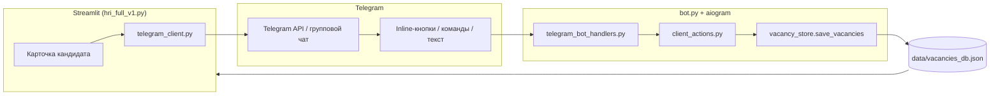

# Архитектура hr_ai_agent — текущая версия (Streamlit)

> **Это описание работающей сейчас системы.**  
> Планируемая архитектура (Next.js + FastAPI + PostgreSQL + ARQ) — в отдельном файле:  
> **[`ARCHITECTURE_TARGET.md`](./ARCHITECTURE_TARGET.md)**  
> Каркас MVP v2 (параллельно, без dual-write): **[`v2/`](./v2/)** — см. `v2/README.md`, cutover: `v2/CUTOVER.md`.

HR-приложение для ведения вакансий, кандидатов и воронки найма. Состоит из **веб-интерфейса (Streamlit)** и **Telegram-бота** — два отдельных процесса, общая файловая база данных.

---

## Стек технологий

| Слой | Технологии |
|------|------------|
| **Фронтенд** | [Streamlit](https://streamlit.io/) — UI рендерится на сервере, отдельного SPA нет. Стили: `corporate_ui.py`, `eval_ui.py`, доп. страницы в `pages/`. Лимит загрузки файлов: `.streamlit/config.toml` (`maxUploadSize`, сейчас 600 МБ). |
| **Бэкенд** | Python 3.11. Логика в модулях корня репозитория. Entry point: `hri_full_v1.py` (веб) и `bot.py` (Telegram). |
| **Telegram** | [aiogram](https://docs.aiogram.dev/) 3.x — long polling, inline-кнопки, команды в групповых чатах. Опционально прокси и IPv4: `TELEGRAM_PROXY`, `TELEGRAM_FORCE_IPV4` в `.env`. |
| **ИИ** | OpenAI-совместимый API (RouterAI) — `ai_helpers.py`: единая точка вызова, лимиты токенов, JSON mode, восстановление битого JSON. Промпты: `hri_full_v1_config.yaml`. |
| **Аудио/видео** | Яндекс SpeechKit (`YANDEX_API_KEY`), локальный `ffmpeg` для извлечения звука из видео. Поиск бинарника: `resolve_ffmpeg_binary()` в `hri_full_v1.py` (Homebrew `/opt/homebrew/bin`, `/usr/local/bin`). |
| **Интеграции** | Яндекс.Диск (`yandex_disk_ingest.py`), Google Calendar (`google_calendar.py`), опционально S3 (`boto3`). |
| **База данных** | **JSON-файлы** в `data/` — атомарная запись и file lock (`fcntl`) в `vacancy_store.py`. |
| **Локальный запуск** | `scripts/start_local.sh` — Streamlit + бот в фоне; `install_mac_launcher.sh` — ярлыки на рабочий стол macOS. |
| **Деплой** | Docker (`Dockerfile`, `docker-compose.yml`): `hr-app` (Streamlit :8501) и `hr-bot` (`bot.py`). Общий volume `./data`. |

**Зависимости:** `requirements.txt` — streamlit, openai, aiogram, requests, PyPDF2, python-docx, openpyxl, google-api-python-client и др.

**Конфигурация:** `.env` (токены, ключи API), `hri_full_v1_config.yaml` (промпты и параметры ИИ).

---

## Ограничения текущей версии (важно для миграции)

| Тема | Как сейчас |
|------|------------|
| **Долгие задачи** | Генерация, расшифровка, синхронизация выполняются синхронно в обработчике кнопки Streamlit (`st.spinner`). UI сессии блокируется; параллельная работа в той же сессии ненадёжна. |
| **Клиенты / тенанты** | `client_id` + `departments.json` — подразделения одной установки, без жёсткой изоляции и логина. |
| **Доступ заказчика** | `/client?dept=Название`, `/master` — без auth. |
| **Мессенджер** | Жёсткая привязка к Telegram (`telegram_*` модули, поля `telegram_posts`). |
| **Конфликты записи** | Streamlit и бот пишут в один `vacancies_db.json`; смягчение — file lock + `merge_vacancy_candidates_from_disk`. |

Целевое решение этих ограничений — в [`ARCHITECTURE_TARGET.md`](./ARCHITECTURE_TARGET.md).

---

## Структура проекта

```
hr_ai_agent/
├── hri_full_v1.py          # Точка входа Streamlit: вкладки Вакансии / Статистика / Настройки / Инструкции
├── bot.py                  # Точка входа Telegram-бота (polling, напоминания, команды)
├── vacancy_store.py        # Чтение/запись JSON, миграции, merge полей бота ↔ UI
├── models.py               # Этапы воронки (HR stages), константы, нормализация кандидата
├── ai_helpers.py           # Вызовы ИИ, trim, JSON mode, parse_ai_json_response
│
├── candidate_funnel.py     # Карточки кандидатов, воронка, доп. материалы в чат, автозагрузка с Диска
├── vacancy_tab.py          # Вкладка вакансии: кандидаты, документы, настройки роли
├── vacancy_prep.py         # Подготовка и обновление документов (мастер, мульти-источники, история)
├── corporate_ui.py         # Общий UI: баннеры, стили, pending changes
├── questionnaire_grid.py   # Опросник по интервью
├── stats_tab.py            # Статистика и отчёты
├── client_zone.py          # Клиентская зона (оценка заказчиком)
│
├── telegram_client.py      # Отправка/редактирование карточек, доп. материалы (reply + update)
├── telegram_bot_handlers.py# Callback-кнопки, команды, комментарии из чата
├── telegram_bot_commands.py# Меню команд (/meetings, /candidates, справка)
├── telegram_workflow.py    # Состояние «ожидаем комментарий» в боте
├── telegram_reminders.py   # Напоминания о встречах (фоновый tick в bot.py)
├── telegram_notify.py      # Отправка HTML, статус бота, normalize_chat_id
├── telegram_chat_id.py     # resolve_vacancy_chat_id: chats_db → runtime → поле вакансии
├── interview_attendance.py # Подтверждение явки на собеседование
├── client_actions.py       # Бизнес-логика действий заказчика → запись в JSON
│
├── resume_ai.py            # Парсинг резюме, генерация опросника/профиля, ссылки Яндекс.Диск
├── yandex_disk_ingest.py   # Синхронизация файлов с Яндекс.Диска
├── google_calendar.py      # События в Google Calendar
├── interview_schedule.py   # Валидация и напоминания по расписанию
├── network_ipv4.py         # Принудительный IPv4 для Telegram на VPS/Mac
│
├── scripts/                # start_local.sh, stop_local.sh, status_local.sh, install_mac_launcher.sh
├── pages/                  # Доп. страницы Streamlit (client, master)
├── data/                   # Данные и секреты (в .gitignore)
├── deploy/                 # Инструкции деплоя, TELEGRAM_CLIENT.md, sync-to-server.sh
├── fonts/                  # Шрифты для PDF
├── .cursor/                # DEVLOG, правила для AI-ассистента
├── ARCHITECTURE.md         # Этот файл — текущая архитектура (Streamlit)
├── ARCHITECTURE_TARGET.md  # Планируемая архитектура (v2)
├── Dockerfile
├── docker-compose.yml
└── requirements.txt
```

### Каталог `data/` (основные файлы)

| Файл | Назначение |
|------|------------|
| `vacancies_db.json` | **Главная БД:** вакансии, кандидаты, этапы, `extra_materials`, посты в Telegram |
| `departments.json` | Подразделения / клиенты |
| `chats_db.json` | Привязка Telegram chat_id к подразделениям (источник для новых вакансий) |
| `vacancy_templates.json` | Шаблоны вакансий (документы + chat_id) |
| `history/` | Архив прошлых генераций документов (можно подставить без применения к вакансии) |
| `google_calendar_*.json` | OAuth-токены Google Calendar |
| `telegram_scheduler_state.json` | Состояние планировщика напоминаний |

---

## Документы по вакансии

Генерация и обновление — в `vacancy_prep.py`, UI — «Документы по вакансии» внутри открытой вакансии (`vacancy_tab.py` → `render_existing_documents_zone`).

### Режимы мастера «Создать или обновить документы»

| Режим | Когда использовать |
|-------|-------------------|
| **Профиль + дополнения** | Есть письменный профиль (в вакансии или файле) + одна или несколько записей/файлов. ИИ объединяет источники с приоритетами: указания HR → профиль → доп. материалы. |
| **Из материалов** | Один или несколько файлов / аудио / видео / вставленный текст — полный пакет с нуля. |
| **Готовые документы** | Импорт уже написанных профиля, опросника, текста вакансии, ключевых слов. |
| **Скорректировать существующие** | Точечные правки: указания HR + опционально новый файл/запись. |
| **Анкета HR** | Пошаговый wizard (как при создании вакансии). |

Общий поток: сбор источников → генерация в памяти → **предпросмотр** → выбор полей для замены → сохранение в `vacancy.documents` и запись в `data/history/`. Пакет можно **сохранить в историю без применения** к текущей вакансии (другая должность / черновик).

Архивные вакансии: документы обновляются с предупреждением; воронка кандидатов не меняется.

### Создание новой вакансии

`render_creation_zone` — режимы «Из расшифровки», «Импорт», «Анкета HR» только на этапе «Создание новой вакансии». После регистрации вакансии дальнейшие правки — через мастер в карточке вакансии.

---

## Как данные попадают из Telegram-бота в базу

Оба процесса читают и пишут **один файл** `data/vacancies_db.json`. При сохранении из UI `merge_vacancy_candidates_from_disk` не затирает поля, обновлённые ботом (`client_status`, `client_comment`, `hr_stage`, `telegram_posts`, `extra_materials` и др.).

### Схема потока (карточка кандидата)



### Доп. материалы в чат

HR указывает название и ссылку в карточке кандидата → `send_extra_material_to_chat`: **reply** на основную карточку + **редактирование** основной карточки (блок материалов) → поля `extra_materials[]` в JSON.

### Пошагово (статусы заказчика)

1. **HR отправляет кандидата** — `send_candidate_card_to_chat` → inline-клавиатура → `_persist_telegram_post` (`chat_id`, `message_id`, `tg_callback_id`).
2. **Заказчик нажимает кнопку** — `telegram_bot_handlers` → при необходимости `telegram_workflow` запрашивает комментарий → `client_actions.apply_and_save_client_action`.
3. **Обновление карточки** — `apply_client_update` → `save_vacancies`.
4. **Streamlit подхватывает** — при следующей загрузке `merge_vacancy_candidates_from_disk`.

### Дополнительные записи из бота

| Модуль | Что пишет в JSON |
|--------|------------------|
| `telegram_reminders.py` | Флаги напоминаний (`interview_reminder_60_sent`, утренние DM) |
| `interview_attendance.py` | Статус явки, отмена встречи |
| `client_actions.apply_and_save_confirm_hr_meeting` | `meeting_hr_confirmed` |

---

## Привязка Telegram-чата

Цепочка: **группа в Telegram** → **запись в `chats_db.json`** (Настройки) → **выбор чата при создании вакансии** → поле `vacancy.chat_id` и `client_id` (подразделение).

Разрешение chat_id при отправке: `telegram_chat_id.resolve_vacancy_chat_id` — сначала чат подразделения из `chats_db.json`, иначе поле вакансии.

Подробная пошаговая инструкция для HR — вкладка **«Инструкции»** в приложении и блок **«Мои чаты Telegram»** в Настройках. Техническая справка: `deploy/TELEGRAM_CLIENT.md`.

---

## Запуск локально

### По клику с рабочего стола (macOS)

```bash
cd /path/to/hr_ai_agent
./scripts/install_mac_launcher.sh
```

На рабочем столе: **Start HR Agent** / **Stop HR Agent**. Запуск в фоне (`nohup`), логи: `run/logs/`. Скрипт добавляет Homebrew в `PATH` (нужно для `ffmpeg` при запуске из Finder).

Только веб без бота: `HR_LOCAL_SKIP_BOT=1 ./scripts/start_local.sh`

Проверка: `./scripts/status_local.sh` · остановка: `./scripts/stop_local.sh`

### Вручную в терминале

```bash
# Веб-приложение
streamlit run hri_full_v1.py

# Бот (отдельный терминал) — обязателен для кнопок и команд в чате
python bot.py
```

Оба процесса должны видеть одну папку `data/` и файл `.env`.

**Важно:** не запускайте два экземпляра `bot.py` с одним `TELEGRAM_BOT_TOKEN` — polling конфликтует, кнопки перестают отвечать.

---

## Переменные окружения (основные)

| Переменная | Назначение |
|------------|------------|
| `TELEGRAM_BOT_TOKEN` | Токен бота от @BotFather |
| `TELEGRAM_HR_CONFIRM_USERNAME` | Username HR для подтверждения встреч в чате |
| `TELEGRAM_HR_USER_ID` | Личный chat_id HR (утренние напоминания) |
| `ROUTERAI_API_KEY` | Ключ ИИ API |
| `YANDEX_API_KEY` | SpeechKit (расшифровка) |
| `TELEGRAM_PROXY` | Прокси, если `api.telegram.org` недоступен |
| `PUBLIC_APP_BASE_URL` | Базовый URL для ссылок клиентских зон на VPS |

Полный список: `.env.example`.
