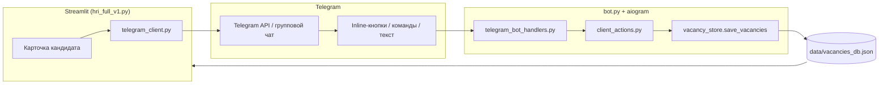

# Архитектура hr_ai_agent

HR-приложение для ведения вакансий, кандидатов и воронки найма. Состоит из **веб-интерфейса (Streamlit)** и **Telegram-бота** — два отдельных процесса, общая файловая база данных.

---

## Стек технологий

| Слой | Технологии |
|------|------------|
| **Фронтенд** | [Streamlit](https://streamlit.io/) — UI рендерится на сервере, отдельного SPA (React/Vue) нет. Стили и компоненты: `corporate_ui.py`, `eval_ui.py`, мульти-страничность через `pages/`. |
| **Бэкенд** | Python 3.11. Логика разнесена по модулям в корне репозитория. Два entry point: `hri_full_v1.py` (веб) и `bot.py` (Telegram). |
| **Telegram** | [aiogram](https://docs.aiogram.dev/) 3.x — long polling, inline-кнопки, команды в групповых чатах. |
| **ИИ** | OpenAI API (`openai`) — разбор резюме, оценка кандидатов, генерация вопросов, продуктивность HR. |
| **Интеграции** | Яндекс.Диск (публичные папки, `yandex_disk_ingest.py`), Google Calendar (`google_calendar.py`), опционально S3 (`boto3`). |
| **База данных** | **JSON-файлы** в `data/` — не PostgreSQL/SQLite. Атомарная запись и file lock (`fcntl`) в `vacancy_store.py`. |
| **Деплой** | Docker (`Dockerfile`, `docker-compose.yml`): контейнер `hr-app` (Streamlit :8501) и `hr-bot` (`bot.py`). Общий volume `./data`. |

**Зависимости:** `requirements.txt` — streamlit, openai, aiogram, requests, PyPDF2, python-docx, openpyxl, google-api-python-client и др.

**Конфигурация:** `.env` (токены Telegram, OpenAI, ключи API), `hri_full_v1_config.yaml` (промпты и параметры ИИ).

---

## Структура проекта

```
hr_ai_agent/
├── hri_full_v1.py          # Точка входа Streamlit-приложения
├── bot.py                  # Точка входа Telegram-бота
├── vacancy_store.py        # Чтение/запись JSON, миграции, merge полей бота ↔ UI
├── models.py               # Этапы воронки (HR stages), константы
│
├── candidate_funnel.py     # Карточки кандидатов, воронка, автозагрузка с Диска
├── vacancy_tab.py          # Вкладка вакансии в UI
├── vacancy_prep.py         # Подготовка вакансии (профиль, вопросы, ключевые слова)
├── corporate_ui.py         # Общий UI: баннеры, стили, pending changes
├── questionnaire_grid.py   # Опросник по интервью
├── stats_tab.py            # Статистика и отчёты
├── client_zone.py          # Клиентская зона (оценка заказчиком)
│
├── telegram_client.py      # Отправка карточек кандидата в Telegram
├── telegram_bot_handlers.py# Callback-кнопки, команды, комментарии из чата
├── telegram_workflow.py    # Состояние «ожидаем комментарий» в боте
├── telegram_reminders.py   # Напоминания о встречах (фоновый tick в bot.py)
├── interview_attendance.py # Подтверждение явки на собеседование
├── client_actions.py       # Бизнес-логика действий заказчика → запись в JSON
│
├── resume_ai.py            # Парсинг резюме, ссылки Яндекс.Диск
├── yandex_disk_ingest.py   # Синхронизация файлов с Яндекс.Диска
├── google_calendar.py      # События в Google Calendar
├── interview_schedule.py   # Валидация и напоминания по расписанию
│
├── pages/                  # Доп. страницы Streamlit (client, master)
├── data/                   # Данные и секреты (в .gitignore)
├── deploy/                 # Инструкции деплоя, sync-to-server.sh
├── fonts/                  # Шрифты для PDF
├── .cursor/                # DEVLOG, правила для AI-ассистента
├── Dockerfile
├── docker-compose.yml
└── requirements.txt
```

### Каталог `data/` (основные файлы)

| Файл | Назначение |
|------|------------|
| `vacancies_db.json` | **Главная БД:** вакансии, кандидаты, этапы, ссылки, посты в Telegram |
| `departments.json` | Подразделения / клиенты |
| `chats_db.json` | Привязка Telegram chat_id к подразделениям |
| `vacancy_templates.json` | Шаблоны вакансий |
| `history/` | Архив прошлых генераций документов |
| `google_calendar_*.json` | OAuth-токены Google Calendar |
| `telegram_scheduler_state.json` | Состояние планировщика напоминаний |

---

## Как данные попадают из Telegram-бота в базу

Оба процесса (Streamlit и бот) читают и пишут **один файл** `data/vacancies_db.json`. Конфликты при одновременной записи смягчаются file lock и полем `merge_vacancy_candidates_from_disk`: при сохранении из UI поля, обновлённые ботом (`client_status`, `client_comment`, `hr_stage`, `telegram_posts` и др.), не затираются.

### Схема потока



### Пошагово

1. **HR отправляет кандидата в чат** (кнопка в Streamlit)  
   `telegram_client.send_candidate_card_to_chat` → сообщение с inline-клавиатурой в Telegram → `_persist_telegram_post` сохраняет `chat_id`, `message_id`, `tg_callback_id` в карточку кандидата → `save_vacancies`.

2. **Заказчик нажимает кнопку в Telegram** (Встреча / Отказ / Подумать / комментарий)  
   `bot.py` получает `callback_query` → `telegram_bot_handlers.register_client_zone_handlers` → при необходимости `telegram_workflow` запрашивает текст комментария → `client_actions.apply_and_save_client_action`.

3. **Обновление карточки**  
   `apply_client_update` меняет поля кандидата (`client_status`, `client_comment`, дата/время встречи, `hr_stage`, история этапов) → `save_vacancies(data)` записывает весь JSON на диск.

4. **Streamlit подхватывает изменения**  
   При следующей загрузке или сохранении из UI `merge_vacancy_candidates_from_disk` подмешивает в память актуальные Telegram-поля с диска.

### Дополнительные записи из бота

| Модуль | Что пишет в JSON |
|--------|------------------|
| `telegram_reminders.py` | Флаги отправленных напоминаний (`interview_reminder_60_sent`, утренние DM) |
| `interview_attendance.py` | Статус явки (`interview_attendance_status`, отмена встречи) |
| `client_actions.apply_and_save_confirm_hr_meeting` | Подтверждение встречи HR (`meeting_hr_confirmed`) |

### Обратное направление (UI → Telegram)

Изменения HR в Streamlit сохраняются через `candidate_funnel._persist_vacancy_candidates` → тот же `vacancies_db.json`. Отправка/редактирование сообщений в чате — снова через `telegram_client.py`.

---

## Запуск локально

### По клику с рабочего стола (macOS)

Один раз в терминале (после обновления репозитория — запустить снова):

```bash
cd /path/to/hr_ai_agent
./scripts/install_mac_launcher.sh
```

На рабочем столе появятся **Start HR Agent** и **Stop HR Agent** (собираются через `osacompile`).  
При первом запуске macOS может спросить разрешение — нажмите **OK**.  
Запуск идёт в фоне (`nohup`) — **закрытие терминала не останавливает** приложение. Логи: `run/logs/`.

Только веб без бота: `HR_LOCAL_SKIP_BOT=1 ./scripts/start_local.sh`

### Вручную в терминале

```bash
# Веб-приложение
streamlit run hri_full_v1.py

# Бот (отдельный терминал)
python bot.py
```

Оба процесса должны видеть одну папку `data/` и файл `.env`.
