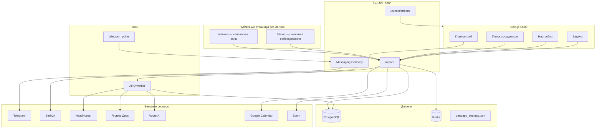

# Архитектура hr_ai_agent (v2)

> **Источник истины с 2026-08-03:** PostgreSQL + Next.js UI + FastAPI + ARQ + Messaging Gateway.  
> Быстрый старт: [`v2/README.md`](./v2/README.md). Cutover и откат: [`v2/CUTOVER.md`](./v2/CUTOVER.md).  
> Долгосрочные цели: [`ARCHITECTURE_TARGET.md`](./ARCHITECTURE_TARGET.md).  
> Legacy Streamlit + JSON + `bot.py` — **не запускать** параллельно с v2 poller на том же `TELEGRAM_BOT_TOKEN`.

HR-приложение для ведения вакансий, кандидатов и воронки найма. Рекрутер работает в веб-UI; заказчик — через Bitrix24, Telegram или секретную веб-зону `/c/…`.

---

## Стек

| Слой | Технологии |
|------|------------|
| **UI** | Next.js 14+ (App Router), TypeScript, CSS variables — `v2/frontend/` |
| **API** | FastAPI REST `/api/v1` — `v2/backend/app/api/v1/routes/` |
| **Auth** | JWT в httpOnly cookies; роли `platform_owner` / `hr_recruiter` |
| **БД** | PostgreSQL (Docker `:5433`), SQLAlchemy; JSONB: `vacancy.documents`, `candidate.payload` |
| **Очереди** | Redis (`:6380`) + ARQ worker |
| **Мессенджер** | Messaging Gateway → Telegram / Bitrix24 / Web Client Zone |
| **ИИ** | OpenAI-совместимый API (RouterAI); модель в `data/app_settings.json` |
| **Аудио/видео** | Яндекс SpeechKit + Object Storage + ffmpeg |
| **Интеграции** | HH.ru, Яндекс.Диск (public + OAuth + inbox), Google Calendar, Zoom |
| **Конфиг** | `v2/.env`, `data/app_settings.json`, OAuth-токены в `data/*.json` |
| **Деплой** | Docker Compose (`v2/docker-compose.yml`, prod — `DEPLOY.md`) |

---

## Общая схема



---

## Структура репозитория

```
hr_ai_agent/
├── ARCHITECTURE.md          ← этот файл
├── ARCHITECTURE_TARGET.md   ← целевое состояние
├── data/                    ← legacy snapshot + app_settings + OAuth tokens (read-only для импорта)
├── v2/
│   ├── docker-compose.yml
│   ├── .env.example
│   ├── backend/app/
│   │   ├── main.py
│   │   ├── api/v1/routes/   ← auth, vacancies, candidates, hh, jobs, stats, messaging, integrations, …
│   │   ├── core/            ← config, auth
│   │   ├── db/models.py
│   │   ├── schemas.py
│   │   ├── services/        ← доменная логика
│   │   └── workers/         ← ARQ tasks, telegram_poller
│   └── frontend/
│       ├── app/             ← страницы App Router
│       ├── components/      ← CandidateEditor, AppShell, …
│       └── lib/             ← api.ts, labels.ts
└── (legacy) hri_full_v1.py, bot.py, … — только откат/справка
```

---

## Модель данных (PostgreSQL)

| Сущность | Назначение |
|----------|------------|
| `organizations` | Тенант; `integrations` JSONB (Zoom tokens и др.) |
| `users` / `org_memberships` | Пользователи и роли |
| `clients` | Компании и подразделения (`parent_id`, `chat_mode`, `client_zone_token`) |
| `vacancies` | Вакансия: `documents`, `payload` (HH preset, yandex_disk, stage_schema, warranty) |
| `candidates` | Кандидат: `hr_stage`, `client_status`, `payload` (материалы, ИИ, опросник, transcript, interview_digest) |
| `jobs` | Фоновые задачи ARQ + прогресс |
| `inbox_items` | Очередь роутинга `_inbox` на Я.Диске |
| `hh_shortlist_items` / `hh_seen_resumes` | Shortlist и «уже смотрели» |
| `messaging_channels` / `messaging_posts` / `messaging_actions` | Каналы и карточки заказчику |
| `document_generations` | История генераций документов |
| `vacancy_templates` | Шаблоны для создания вакансий |
| `import_runs` | Статистика импорта из JSON |

Импорт snapshot: `python -m app.scripts.import_json --data-dir ../../data` (только чтение `data/`).

---

## UI: навигация

### Главная `/`

Хаб модулей. **Сейчас активен:** «Поиск сотрудников». Остальные карточки — «скоро».

### Поиск сотрудников (`AppShell variant=search`)

**Верхнее меню:** Вакансии · Кандидаты · Шаблоны · Статистика · Задачи* · История* · Клиентская зона · Inbox*  
\* — только `platform_owner`; Inbox — если включён роутинг inbox.

**Боковая панель:** фильтр по клиенту/компании.

**Ключевые экраны:**
- `/vacancies`, `/vacancies/[id]` — список и карточка вакансии (кандидаты, документы, HH, Я.Диск)
- `/candidates`, `/candidates/[id]` — список и карточка кандидата
- `/stats` — оперативная и executive-аналитика
- `/jobs` — фоновые задачи + ручная расшифровка
- `/history` — история генераций документов
- `/templates` — шаблоны вакансий

### Настройки `/settings`

Хаб карточек + боковая панель «Ресурсы». Подстраницы: ИИ, функции, intake, компании, Bitrix, Telegram, календарь, гарантия, внешний вид, about.

### Публичные страницы (без логина)

| URL | Назначение |
|-----|------------|
| `/c/[token]` | Клиентская зона: список кандидатов, решение (встреча / подумать / отказ) |
| `/i/[token]` | Выжимка собеседования для заказчика (Q&A без HR-заметок о стиле речи) |
| `/login` | Вход |

---

## Доменные потоки (кратко)

### Воронка кандидата

Этапы HR и статусы заказчика — системные ключи. На вакансии: `payload.stage_schema` (подписи, вкл/выкл). Отправка заказчику → канал (Telegram / Bitrix / Web). Inbound обновляет `client_status` и комментарии.

### HH cold search

Preset в `vacancy.documents.hh_preset` → job `hh_cold_search` → prefilter → ИИ-оценка → shortlist → перенос в кандидата. Ручная оценка ссылок HH отдельно.

### Яндекс.Диск

| Режим | Суть |
|-------|------|
| Public sync | Публичная папка вакансии → PDF/видео по ФИО |
| OAuth | Создание дерева папок, publish ссылок |
| Inbox | `_inbox`: PDF → ИИ → «Резюме»; видео/аудио → «Записи» по ФИО; иначе `_unsorted` |

### Собеседование

1. Ссылка на запись (`video_link`)  
2. «Расшифровать и оценить» → job `candidate_interview_process`: SpeechKit → очистка текста → **выжимка Q&A** → оценка по интервью → заполнение опросника  
3. Выжимка: `payload.interview_digest` + публичная ссылка `/i/{token}` в карточке заказчику (если задан `PUBLIC_APP_URL`)

### Документы вакансии

Редактор документов, генерация ИИ, пакет из материалов/встречи (`vacancy_docs_from_materials`), история с apply.

### Статистика

Два режима: **оперативный** (активность, «требуют внимания», HH) и **отчёт руководителю** (воронка, закрытые вакансии, гарантия). Фильтры: клиент, вакансия, период, «только в работе».

### Messaging Gateway

Провайдеры: **Bitrix24** (задача + decide-ссылки), **Telegram** (карточка + inline-кнопки), **Web Client Zone** (ссылка `/c/…`).

Флаги: `MESSAGING_OUTBOUND_ENABLED`, `MESSAGING_INBOUND_ENABLED`, `MESSAGING_POLL_ENABLED`.

---

## Фоновые задачи (ARQ)

| Job | Назначение |
|-----|------------|
| `hh_cold_search` | Холодный поиск HH |
| `yandex_disk_sync` | Синхронизация папки вакансии |
| `disk_inbox_router` | Разбор `_inbox` |
| `transcribe_media` | Расшифровка по URL (страница /jobs) |
| `candidate_interview_process` | Расшифровка + выжимка + оценка интервью |
| `candidate_evaluate_resume` | Оценка резюме + опросник |
| `vacancy_docs_from_materials` | Пакет документов из материалов |
| `vacancy_docs_from_brief` / `vacancy_docs_generate` | Генерация документов |
| `import_legacy` | Повторный импорт JSON |
| `demo_progress` | Демо прогресса |

---

## Переменные окружения (основные)

| Переменная | Назначение |
|------------|------------|
| `DATABASE_URL` | PostgreSQL |
| `REDIS_URL` | Redis / ARQ |
| `JWT_SECRET`, `AUTH_*` | Авторизация |
| `TELEGRAM_BOT_TOKEN`, `MESSAGING_*` | Messaging |
| `ROUTERAI_API_KEY`, `AI_*` | ИИ |
| `HH_*` | HeadHunter |
| `YANDEX_*` | SpeechKit / S3 |
| `YANDEX_DISK_*` | OAuth Диска |
| `GOOGLE_CALENDAR_*` | Календарь |
| `ZOOM_*` | Zoom OAuth |
| `PUBLIC_APP_URL` | Публичные ссылки `/i/…` для заказчика |
| `NEXT_PUBLIC_API_URL` | API для фронта |

Полный список: `v2/.env.example`.

---

## Запуск (локально)

```bash
cd v2 && docker compose up -d db redis
cd backend && source .venv/bin/activate && set -a && source ../.env && set +a
uvicorn app.main:app --reload --port 8000
arq app.workers.settings.WorkerSettings
cd ../frontend && npm run dev
```

---

# Каталог функций приложения

> Для проектирования UI: где функция живёт сейчас, кто пользователь, зрелость.  
> **UI** — есть экран/кнопка · **API** — только API/worker · **Публично** — без логина HR.

## 1. Ядро: вакансии и кандидаты

| ID | Функция | Пользователь | Где в UI | Зрелость |
|----|---------|--------------|----------|----------|
| V1 | Список вакансий (активные/архив, фильтр клиента) | HR | `/vacancies` | ✅ |
| V2 | Создание вакансии | HR | карточка / шаблон | ✅ |
| V3 | Закрытие / reopen / удаление вакансии | HR | карточка вакансии | ✅ |
| V4 | Настройки вакансии (чат, Bitrix responsible, warranty) | HR | карточка вакансии | ✅ |
| V5 | Схема этапов воронки (labels, вкл/выкл) | HR | карточка вакансии | ✅ |
| V6 | Список кандидатов (presets: attention, hires, client zone…) | HR | `/candidates` | ✅ |
| V7 | Карточка кандидата: анкета, контакты, материалы | HR | `/candidates/[id]` | ✅ |
| V8 | Смена этапа HR + история этапов | HR | карточка кандидата | ✅ |
| V9 | Статус заказчика (ручной / из inbound) | HR | карточка кандидата | ✅ |
| V10 | Копирование кандидата на другую вакансию | HR | карточка кандидата | ✅ |
| V11 | Удаление кандидата | HR | карточка | ✅ |
| V12 | Поиск кандидатов (глобальный) | HR | API + списки | ✅ |
| V13 | «Требуют внимания» — next action | HR | баннер на карточке, stats | ✅ |
| V14 | Гарантия: применить срок / создать гарантийный поиск | HR | карточка вакансии/кандидата | ✅ |

## 2. Документы и шаблоны

| ID | Функция | Пользователь | Где в UI | Зрелость |
|----|---------|--------------|----------|----------|
| D1 | Редактор документов вакансии (профиль, вопросы, оффер…) | HR | вкладка «Документы» | ✅ |
| D2 | Генерация документов ИИ (по профилю) | HR | документы | ✅ |
| D3 | Пакет из материалов/встречи + meeting_brief | HR | документы → job | ✅ |
| D4 | История генераций + apply в вакансию | HR (owner) | `/history` | ✅ |
| D5 | Шаблоны вакансий + создать из шаблона | HR | `/templates` | ✅ |
| D6 | Documents lab (эксперименты) | HR | `/documents-lab` | 🔶 черновик |

## 3. Оценка и опросник

| ID | Функция | Пользователь | Где в UI | Зрелость |
|----|---------|--------------|----------|----------|
| A1 | Оценка резюме ИИ + автоген опросника | HR | карточка → job | ✅ |
| A2 | Опросник: просмотр, правка, сохранение | HR | блок «Опросник и собеседование» | ✅ |
| A3 | Перегенерация опросника по замечаниям HR | HR | настройки опросника | ✅ |
| A4 | Ручное добавление вопросов | HR | опросник | ✅ |
| A5 | Расшифровка записи + оценка интервью | HR | «Расшифровать и оценить» → job | ✅ |
| A6 | Выжимка собеседования (Q&A + стиль речи для HR) | HR | тот же блок, сверху | ✅ |
| A7 | Заполнение опросника из расшифровки | HR | кнопка в опроснике | ✅ |
| A8 | Переоценка по интервью (без повторной расшифровки) | HR | опросник | ✅ |
| A9 | Публичная выжимка для заказчика | Заказчик | `/i/[token]`, ссылка в карточке | ✅ |
| A10 | Ручная расшифровка медиа по URL | HR (owner) | `/jobs` | ✅ |
| A11 | Комментарий ИИ (секции), оценка 0–4 | HR | карточка кандидата | ✅ |

## 4. HeadHunter

| ID | Функция | Пользователь | Где в UI | Зрелость |
|----|---------|--------------|----------|----------|
| H1 | HH preset (api + soft + run) | HR | вкладка HH вакансии | ✅ |
| H2 | Запуск cold search | HR | HH → job | ✅ |
| H3 | Shortlist + перенос в кандидата | HR | HH панель | ✅ |
| H4 | Seen / история поисков | HR | HH | ✅ |
| H5 | Ручная оценка ссылок HH | HR | HH | ✅ |
| H6 | Soften checklist (ИИ-предложения) | HR | HH | ✅ |
| H7 | Legacy plan/criteria API | — | API | 🔶 скрыто в UI |

## 5. Яндекс.Диск и intake

| ID | Функция | Пользователь | Где в UI | Зрелость |
|----|---------|--------------|----------|----------|
| Y1 | OAuth + корень + inbox папка | owner | `/settings/yandex-disk` | ✅ |
| Y2 | Ensure folders на вакансии | HR | вкладка Я.Диск | ✅ |
| Y3 | Sync папки вакансии (PDF/видео → кандидаты) | HR | Я.Диск → job | ✅ |
| Y4 | Inbox routing (PDF→резюме, видео→записи по ФИО) | HR | кнопка Inbox + job | ✅ |
| Y5 | Unsorted: ручная привязка | HR | settings/yandex-disk inbox UI | ✅ |
| Y6 | Флаги intake: ссылка / sync / inbox | owner | `/settings/candidate-intake` | ✅ |
| Y7 | Bulk PDF-ссылки на вакансии | HR | API | ✅ |

## 6. Взаимодействие с заказчиком

| ID | Функция | Пользователь | Где в UI | Зрелость |
|----|---------|--------------|----------|----------|
| M1 | Отправить кандидата заказчику | HR | карточка «Заказчик» | ✅ |
| M2 | Telegram: карточка + inline-кнопки статуса | Заказчик | Telegram | ✅ |
| M3 | Bitrix24: задача + decide-ссылки | Заказчик | Bitrix | ✅ |
| M4 | Web Client Zone `/c/[token]` | Заказчик | публичная страница | ✅ |
| M5 | Inbound: callback → обновление статуса в PG | Заказчик | webhook/poller | ✅ |
| M6 | Обновить карточку в Telegram | HR | карточка | ✅ |
| M7 | Напоминание заказчику (remind) | HR | карточка | ✅ |
| M8 | Digest вакансии в чат | HR | карточка вакансии | ✅ |
| M9 | Каналы messaging: sync, test message | owner | `/settings/telegram` | ✅ |
| M10 | WhatsApp / Max | — | заглушка в registry | ⏳ |

## 7. Встречи и календарь

| ID | Функция | Пользователь | Где в UI | Зрелость |
|----|---------|--------------|----------|----------|
| C1 | Дата/время/формат встречи на карточке | HR | карточка | ✅ |
| C2 | Google Calendar OAuth + события | HR | `/settings/calendar` | ✅ |
| C3 | Zoom meeting на карточке | HR | карточка | ✅ |
| C4 | Подтверждение встречи HR / явка | HR | карточка | ✅ |
| C5 | Шаблоны коммуникаций (Zoom/Телемост/…) | owner | `/settings/candidate-comms` | 🔶 хранение |

## 8. Аналитика и отчёты

| ID | Функция | Пользователь | Где в UI | Зрелость |
|----|---------|--------------|----------|----------|
| S1 | Dashboard: оперативный / executive | HR | `/stats` | ✅ |
| S2 | KPI, активность, воронка, таблица вакансий | HR | stats | ✅ |
| S3 | «Требуют внимания» в stats | HR | stats | ✅ |
| S4 | HH efficiency block | HR | stats (operational) | ✅ |
| S5 | Риски и гарантия за период | HR | stats (executive) | ✅ |
| S6 | Реестр гарантий | HR | stats | ✅ |
| S7 | Import stats (сверка с JSON) | owner | API `/stats/import` | ✅ |
| S8 | Закрытые вакансии **по причинам** | HR | — | ⏳ нет в UI |

## 9. Фоновые задачи и события

| ID | Функция | Пользователь | Где в UI | Зрелость |
|----|---------|--------------|----------|----------|
| J1 | Список jobs + прогресс | owner | `/jobs`, badge в шапке | ✅ |
| J2 | Отмена job | owner | jobs | ✅ |
| J3 | Live toasts (JobsLive) | HR | глобально | ✅ |
| J4 | SSE `/events/stream` | HR | фон | ✅ |

## 10. Настройки и администрирование

| ID | Функция | Пользователь | Где в UI | Зрелость |
|----|---------|--------------|----------|----------|
| N1 | Вход / logout / refresh token | все | `/login` | ✅ |
| N2 | Роли owner vs recruiter | owner | скрытие пунктов меню | ✅ |
| N3 | Компании и подразделения | owner | `/settings/companies` | ✅ |
| N4 | Client zone token rotate | owner | companies | ✅ |
| N5 | Тестовый чат | owner | `/settings/test-chat` | ✅ |
| N6 | Feature flags (`functions`) | owner | `/settings/functions` | ✅ |
| N7 | Модель ИИ + ссылки провайдеров | owner | `/settings/ai` | ✅ |
| N8 | Bitrix webhook + test task | owner | `/settings/bitrix` | ✅ |
| N9 | Гарантия по умолчанию | owner | `/settings/warranty` | ✅ |
| N10 | Тема и масштаб шрифта | HR | `/settings/appearance` | ✅ |
| N11 | Личные notify prefs (Telegram digest) | HR | calendar settings | ✅ |
| N12 | Useful links (персональные) | HR | sidebar | ✅ |
| N13 | Описание функционала | все | `/settings/about` | ✅ |

## 11. Планируемые модули (главная)

| Модуль | Статус |
|--------|--------|
| Настройки управления персоналом | ⏳ заглушка на `/` |
| Кадровое делопроизводство | ⏳ |
| Управление персоналом (опросы, NDA) | ⏳ |
| Корректировка и развитие (ИПР, аттестации) | ⏳ |

---

## Заметки для перераспределения UI

**Сейчас смешано в одном «Поиск сотрудников»:**
- операционка (кандидаты, внимание, отправка заказчику);
- sourcing (HH, inbox, disk sync);
- аналитика (stats);
- админка (jobs, history — owner);
- подготовка вакансии (документы, шаблоны).

**Кандидатская карточка перегружена:** анкета, этапы, заказчик, ИИ, опросник, расшифровка, выжимка, материалы, встречи — один длинный скролл.

**Настройки vs операции:** intake, disk, Bitrix, Telegram разнесены между `/settings` и карточками — имеет смысл явно разделить «настроить один раз» и «делать каждый день».

**Публичные поверхности:** `/c/…` (решение) и `/i/…` (выжимка) — разные задачи заказчика; в UI HR их стоит показывать рядом с «Отправить заказчику».

---

## Связанные документы

| Файл | Содержание |
|------|------------|
| [`v2/README.md`](./v2/README.md) | MVP, быстрый старт |
| [`v2/CUTOVER.md`](./v2/CUTOVER.md) | Cutover, откат |
| [`v2/DEPLOY.md`](./v2/DEPLOY.md) | Prod на Timeweb |
| [`ARCHITECTURE_TARGET.md`](./ARCHITECTURE_TARGET.md) | Целевая архитектура |
| [`.cursor/DEVLOG.md`](./.cursor/DEVLOG.md) | Журнал изменений |
