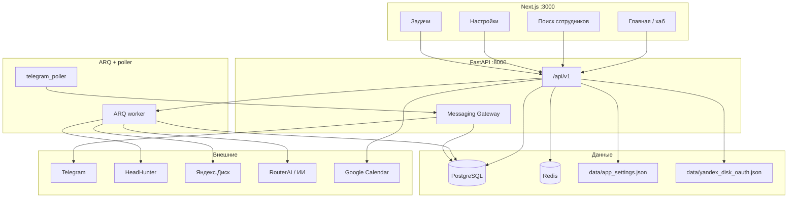
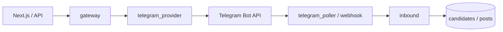

# Архитектура hr_ai_agent — текущая версия (v2)

> **Источник истины с 2026-08-03:** PostgreSQL + Next.js UI + FastAPI + ARQ + Messaging Gateway.  
> Cutover и откат: [`v2/CUTOVER.md`](./v2/CUTOVER.md). Быстрый старт: [`v2/README.md`](./v2/README.md).  
> Оставшиеся целевые пункты (auth, мультипровайдерный messaging): [`ARCHITECTURE_TARGET.md`](./ARCHITECTURE_TARGET.md).  
> Streamlit + JSON + `bot.py` — **legacy** (корневые модули репозитория); не запускать параллельно с v2 poller на том же `TELEGRAM_BOT_TOKEN`.

HR-приложение для ведения вакансий, кандидатов и воронки найма. Заказчик реагирует в Telegram; HR работает в веб-интерфейсе v2.

---

## Стек технологий

| Слой | Технологии |
|------|------------|
| **UI** | Next.js (App Router) + TypeScript — `v2/frontend/` |
| **API** | FastAPI REST `/api/v1` — `v2/backend/app/` |
| **БД** | PostgreSQL (Docker `:5433`) — SQLAlchemy models, JSONB для `documents` / `payload` |
| **Очереди** | Redis (`:6380`) + **ARQ** worker — HH, Disk sync, inbox router, transcribe |
| **Мессенджер** | Messaging Gateway → TelegramProvider; inbound: webhook **или** long-poll (`telegram_poller`) |
| **ИИ** | OpenAI-совместимый API (RouterAI по умолчанию) — `ai_json.py`; модель переопределяется в `data/app_settings.json` |
| **Аудио/видео** | Яндекс SpeechKit + Object Storage (`YANDEX_*`) + `ffmpeg` — job `transcribe_media` |
| **Интеграции** | HH API, Яндекс.Диск (public sync + OAuth + AI inbox L3), Google Calendar |
| **Конфиг** | `v2/.env` (+ корневой `.env` для общих ключей), `data/app_settings.json` для UI-настроек |
| **Запуск** | `v2/docker-compose.yml` (db/redis/api/frontend/worker; profile `messaging` → poller) |

**Не на текущем этапе:** auth/роли в UI, dual-write в Streamlit JSON, OCR сканов в inbox, cron auto-inbox.

---

## Общая схема



---

## Структура `v2/`

```
v2/
├── docker-compose.yml
├── .env.example
├── README.md
├── CUTOVER.md
├── backend/
│   ├── alembic/                 # миграции (при необходимости)
│   ├── app/
│   │   ├── main.py              # FastAPI + lifespan
│   │   ├── api/v1/endpoints.py  # REST
│   │   ├── core/config.py       # Settings / .env
│   │   ├── db/models.py         # Organization, Client, Vacancy, Candidate, Job, …
│   │   ├── schemas.py
│   │   ├── services/            # домен
│   │   │   ├── candidate_*.py, vacancy_*.py, stage_schema.py
│   │   │   ├── hh_*.py, resume_eval.py, hh_manual_eval.py
│   │   │   ├── yandex_disk_sync.py, yandex_disk_oauth.py, yandex_public.py
│   │   │   ├── app_settings.py, ai_json.py, jobs.py, stats_service.py
│   │   │   ├── google_calendar.py, warranty.py, transcription.py
│   │   │   └── messaging/       # gateway, telegram, inbound, keyboards, …
│   │   ├── workers/
│   │   │   ├── tasks.py         # ARQ jobs
│   │   │   ├── settings.py
│   │   │   └── telegram_poller.py
│   │   └── scripts/import_json.py
│   └── requirements.txt
└── frontend/
    ├── app/                     # App Router pages
    │   ├── page.tsx             # главная (хаб)
    │   ├── vacancies/, candidates/, stats/, jobs/, history/
    │   ├── settings/            # хаб + подстраницы
    │   └── client-zone/         # заготовка
    ├── components/              # AppShell, HhSearchPanel, CandidateEditor, …
    └── lib/                     # api.ts, labels.ts, companies.ts
```

Legacy Streamlit остаётся в **корне** репозитория (`hri_full_v1.py`, `bot.py`, `vacancy_store.py`, …) для отката и справки.

---

## Модель данных (PostgreSQL)

| Сущность | Назначение |
|----------|------------|
| `organizations` | Тенант-обёртка (сейчас одна org по умолчанию) |
| `clients` | Компании / подразделения / тестовый чат (`parent_id`, `chat_mode`, `kind`) |
| `vacancies` | Вакансия: `documents` (JSONB), `payload` (настройки, warranty, yandex_disk, stage_schema) |
| `candidates` | Кандидат: `hr_stage`, `client_status`, `payload` (JSONB) |
| `jobs` | Фоновые задачи + прогресс + payload результатов (HH, inbox) |
| `inbox_items` | Очередь роутинга Яндекс.Диск `_inbox` (status: new/routed/unsorted/error) |
| `hh_shortlist_items` / `hh_seen_resumes` | Shortlist и «уже смотрели» |
| `messaging_posts` / channels | Карточки в чатах, inbound-статусы |
| `document_generations` | История генераций документов |

Импорт snapshot: `python -m app.scripts.import_json --data-dir ../../data` (только чтение `data/`).

Мелкие настройки UI/оператора (гарантия по умолчанию, модель ИИ, ссылки провайдеров, Disk root/inbox, candidate_comms) — в **`data/app_settings.json`**.

---

## UI: навигация и разделы

### Главная `/`

Хабы без верхнего меню поиска: **Настройки**, **Разработка документов** (скоро), **Поиск сотрудников**.

### Поиск сотрудников (`AppShell variant=search`)

Верхнее меню: Вакансии · Кандидаты · Статистика · Задачи · История · (клиентская зона — позже).  
Кнопка «← Вернуться в главное меню».

Карточка вакансии: вкладки кандидаты / документы / HH / Я.Диск; внизу управление вакансией, схема этапов, параметры.

### Настройки (`variant=settings`)

Хаб карточек + боковая панель **Ресурсы** (интерактивные ссылки на RouterAI / Яндекс Облако).

| Страница | Содержание |
|----------|------------|
| `/settings/about` | Описание функционала |
| `/settings/ai` | Имя модели ИИ (без смены ключа), ссылки кабинетов, инструкция смены платформы |
| `/settings/yandex-disk` | OAuth, корень, ИИ-роутинг inbox + unsorted |
| `/settings/candidate-comms` | Zoom / Телемост / мессенджеры / шаблоны (хранение; интеграции позже) |
| `/settings/companies` | Компании, режим чатов, подразделения |
| `/settings/test-chat` | Тестовый чат |
| `/settings/telegram` | Статус бота, каналы |
| `/settings/calendar` | Google Calendar OAuth |
| `/settings/appearance` | Тема + масштаб шрифта (localStorage) |
| `/settings/warranty` | Срок гарантии по умолчанию |

---

## Доменные потоки

### Воронка кандидата

- Этапы HR и статусы заказчика — **системные ключи** (`resume_screening`, `offer`, `wait`, …) в `candidate_write` / `labels.ts`.
- На вакансии: **`payload.stage_schema`** — подписи и вкл/выкл; при наличии кандидатов структура заморожена (только labels).
- В списках — цветовой маркер этапа (`StageMarker`).
- Telegram: outbound карточка + inline-кнопки; inbound обновляет `client_status` / комментарии в PG.

### HH cold search

1. Вкладка **«Пресет»**: форма = точные параметры `GET /resumes` (`vacancy.documents.hh_preset`: `api` + `soft` + `run`).
2. Soft-правила (must-have / reject / комментарий) → только скринер ИИ; в HH API не уходят.
3. Job `hh_cold_search` читает `payload.preset` → `search_resume_items_from_preset` → prefilter → оценка → `jobs.payload.results`.
4. Legacy `hh_search_criteria` / `hh_search_plan` ещё в коде; при первом открытии criteria мигрируется в preset. UI плана скрыт (`HH_ADVANCED_UI=false`).
5. **«Вручную»**: оценка ссылок HH + soften checklist.

API: `GET/PUT /vacancies/{id}/hh-preset`, старт через `POST /jobs` с `payload.preset`.

### Яндекс.Диск

| Режим | Как работает |
|-------|----------------|
| **Public sync** | Публичная ссылка → list/download → привязка PDF/видео/заданий по ФИО |
| **OAuth L1** | Токен → `/HR_AI_Agent` + `_inbox` → mkdir/publish папок вакансии |
| **Inbox L3** | PDF из `_inbox` → ИИ-роутинг → `Резюме/` вакансии + кандидат; низкая уверенность → `_unsorted` + UI привязки; таблица `inbox_items`; job `disk_inbox_router` |

SpeechKit (`YANDEX_*`) и Disk OAuth — **разные** креды. Ключи inbox: `disk_inbox_confidence` / `disk_inbox_auto` / `disk_inbox_evaluate` в `app_settings.json`.

### Документы вакансии

Редактор + генерация через ИИ (`document_generate`); история в `document_generations` / UI History.
**Из записи/материалов:** `POST …/documents/from-materials` (upload + ссылки Я.Диска) → job `vacancy_docs_from_materials` → пакет в docs + конспект `meeting_brief` + история; apply из History. Шаблоны: `/templates`.

### Фоновые задачи

ARQ: `hh_cold_search`, `yandex_disk_sync`, `disk_inbox_router`, `transcribe_media`, demo/import. UI: `/jobs` + прогресс в панели HH.

---

## Messaging Gateway



| Флаг | Смысл |
|------|--------|
| `MESSAGING_OUTBOUND_ENABLED` | Отправка карточек/дайджестов |
| `MESSAGING_INBOUND_ENABLED` | Приём callback/сообщений в PG |
| `MESSAGING_POLL_ENABLED` | Локальный getUpdates (не вместе с legacy `bot.py`) |

---

## Переменные окружения (основные)

| Переменная | Назначение |
|------------|------------|
| `DATABASE_URL` | PostgreSQL |
| `REDIS_URL` | Redis для ARQ |
| `TELEGRAM_BOT_TOKEN` | Бот Messaging Gateway |
| `MESSAGING_*` | outbound / inbound / poll |
| `ROUTERAI_API_KEY` / `AI_BASE_URL` / `AI_MODEL_NAME` | ИИ (модель ещё можно переопределить в app_settings) |
| `HH_ACCESS_TOKEN` / `HH_USER_AGENT` | Холодный поиск HH |
| `YANDEX_API_KEY` (+ bucket keys) | SpeechKit / Object Storage |
| `YANDEX_DISK_OAUTH_TOKEN` / `YANDEX_DISK_CLIENT_ID` | Создание папок и inbox на Диске |
| `GOOGLE_CALENDAR_*` | Календарь встреч |
| `NEXT_PUBLIC_API_URL` | Базовый URL API для фронта |
| `CORS_ORIGINS` | CORS FastAPI |

Полные шаблоны: `v2/.env.example`, корневой `.env.example`.

---

## Запуск (кратко)

```bash
cd v2
cp .env.example .env   # + ключи из корневого .env при необходимости
docker compose up -d db redis
# API
cd backend && source .venv/bin/activate
uvicorn app.main:app --reload --port 8000
# Worker
arq app.workers.settings.WorkerSettings
# Poller (если inbound без webhook)
python -m app.workers.telegram_poller
# UI
cd ../frontend && npm run dev   # :3000
```

Или `docker compose up --build` (+ profile `messaging` для poller).

**Важно:** один poller / один процесс на токен Telegram.

---

## Ограничения текущей версии

| Тема | Как сейчас |
|------|------------|
| Auth / роли | Нет; один оператор |
| Клиентская веб-зона | Заготовка; заказчик — в Telegram |
| Disk inbox OCR | Сканы без текста → error / ручной разбор |
| Cron auto inbox | Флаг `disk_inbox_auto`; по умолчанию ручной запуск |
| Смена платформы ИИ | Модель из UI; base URL/ключ — через `.env` + перезапуск |
| Legacy Streamlit | Только откат / справочный код |

Планируемое развитие — в [`ARCHITECTURE_TARGET.md`](./ARCHITECTURE_TARGET.md).

---

## Связанные документы

| Файл | Содержание |
|------|------------|
| [`v2/README.md`](./v2/README.md) | MVP-статус, быстрый старт |
| [`v2/CUTOVER.md`](./v2/CUTOVER.md) | Cutover 2026-08-03, откат |
| [`ARCHITECTURE_TARGET.md`](./ARCHITECTURE_TARGET.md) | Долгосрочная цель / оставшиеся фазы |
| [`.cursor/DEVLOG.md`](./.cursor/DEVLOG.md) | Журнал изменений по сессиям |
