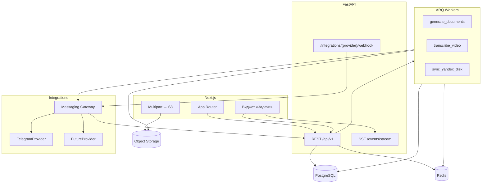

# Архитектура hr_ai_agent — целевая / оставшиеся фазы (v2+)

> **Текущая рабочая SoT (после cutover 2026-08-03)** описана в  
> **[`ARCHITECTURE.md`](./ARCHITECTURE.md)** (`v2/` — Next.js + FastAPI + PostgreSQL + ARQ).  
> Этот файл — исходный целевой план и **ещё не закрытые** пункты (auth, мультипровайдеры, OCR/cron inbox, усиленная мультитенантность). HH-план и Disk inbox L3 уже в текущем `ARCHITECTURE.md`.

Документ фиксировал согласованные решения: мультитенантность, фоновые задачи, уведомления о прогрессе, универсальный messaging gateway, миграция со Streamlit без dual-write.

---

## Зачем менять

| Боль текущей версии | Решение в v2 |
|---------------------|--------------|
| Долгие операции блокируют UI Streamlit | Jobs в ARQ worker; UI свободен |
| Нет надёжной изоляции нескольких клиентов | `Organization` → `Client` + RLS / memberships |
| Общая статистика и отдельные пространства конфликтуют | Фильтр клиентов в аналитике + общий виджет задач аккаунта |
| Жёсткая привязка к Telegram | Messaging Gateway + провайдеры |
| Merge JSON UI ↔ бот | Одна PostgreSQL, транзакции, события |

---

## Целевой стек

| Слой | Технология | Комментарий |
|------|------------|-------------|
| **UI** | Next.js (App Router) + TypeScript | Неблокирующий интерфейс, виджет задач |
| **API** | FastAPI (REST + OpenAPI) | Доменная логика, auth-проверки |
| **БД** | PostgreSQL | Shared DB + `client_id`; JSONB для документов |
| **Очереди** | Redis + **ARQ** | Долгие задачи; короткие — `BackgroundTasks` |
| **Файлы** | S3 / Yandex Object Storage | Presigned multipart upload |
| **Auth** | Supabase Auth (или аналог) + **свои** memberships / invitations | Идентичность у провайдера; политики — наши |
| **Realtime** | SSE (основное), WebSocket позже | Обновления jobs и inbound из мессенджера |
| **ИИ / медиа** | Python services (перенос `ai_helpers`, SpeechKit, ffmpeg) | Workers, не request path UI |
| **Мессенджеры** | Messaging Gateway | Telegram первым; интерфейс для других каналов |

**Не на старте:** Celery, GraphQL, tRPC (бэкенд на Python), полный rewrite домена на TypeScript.

**Опционально для ускорения фазы 0–1:** Supabase (Postgres + Auth + Storage); бизнес-логика всё равно в FastAPI + ARQ.

---

## Общая схема



---

## Мультитенантность и роли

### Иерархия данных

```
Organization
  └── Client (заказчик / пространство)
        ├── Department (опционально)
        ├── Vacancy
        │     └── Candidate
        ├── MessagingChannel
        └── Integrations (Яндекс.Диск и др.)
```

### Роли

| Роль | Видит | Статистика | Задачи |
|------|--------|------------|--------|
| `platform_owner` | Все клиенты организации | Все / выбранные | Все задачи аккаунта |
| `client_admin` | Свой клиент | Свой клиент | Задачи аккаунта (с контекстом клиента) |
| `hr_recruiter` | Назначенные вакансии | Свои вакансии | Задачи аккаунта |
| `hiring_manager` | Клиентская зона | Минимум / нет | Обычно не видит |

### Auth

- Провайдер: Supabase Auth (или fastapi-users / Keycloak) — логин, magic link, OAuth.
- Политики: таблицы `organization_members`, `client_memberships`, `invitations`.
- JWT claims: `org_id`, `user_id`, `roles[]`, `client_ids[]` (или `*` для owner).
- Приглашение внешних менеджеров по email — обязательный сценарий.

---

## Messaging Gateway (не только Telegram)

Домен не знает про «inline-кнопки Telegram». Работает с универсальными действиями и событиями.

### Таблицы

| Таблица | Назначение |
|--------|------------|
| `messaging_channels` | `provider`, `external_id`, `client_id`, метаданные |
| `messaging_posts` | привязка карточки кандидата к сообщению канала |
| `messaging_actions` | ожидание ответа (комментарий, выбор даты) |

### Интерфейс провайдера

- `send_candidate_card(candidate, actions[])`
- `edit_card(post_id, payload)`
- `send_reply(post_id, material)`
- `parse_inbound_webhook(payload) → DomainEvent[]`

Webhook: `POST /integrations/{provider}/webhook` (не `/telegram/...` как единственный путь).

Доменные действия: `APPROVE_INTERVIEW`, `REJECT`, `REQUEST_COMMENT`, …  
Маппинг в кнопки/команды — внутри провайдера. Provider-specific детали — в JSONB.

---

## Фоновые задачи (ARQ) и параллельная работа

Долгие операции **не выполняются в HTTP-запросе UI**.

| Тип | Механизм |
|-----|----------|
| < ~30 с, без retry | FastAPI `BackgroundTasks` |
| 1–15+ мин, retry, прогресс | **ARQ** + Redis |
| Пайплайн (видео → ffmpeg → SpeechKit → генерация) | Один ARQ job с этапами или цепочка + `jobs.progress` |

### Поток

1. UI: `POST /api/v1/jobs/...` → `202` + `job_id`.
2. Worker выполняет задачу; пишет статус в `jobs`.
3. UI свободен: другие вкладки, другие действия.
4. Закрытие вкладки **не отменяет** job.

### Конфликты

- Две генерации на одну вакансию: очередь или отказ с сообщением «уже выполняется».
- Применение результата: snapshot в `document_generations` + отдельный apply с проверкой `vacancy.version`.
- Лимит concurrency worker на VPS/Mac.

---

## Информирование о задачах (UX)

### Виджет боковой панели «Задачи»

Глобальный виджет layout, **общий для аккаунта** (не только текущий клиент/экран).

**В процессе** (`queued`, `running`):
- тип, название, клиент / вакансия, статус, прогресс (% / шаги / «Выполняется…»), время старта;
- клик → детали, опционально отмена.

**Недавно завершённые** (свернуто по умолчанию):
- последние 5–10 задач в компактном виде;
- раскрытие / скролл / «Показать ещё»;
- полный журнал — страница `/jobs`.

**Бейдж:** число активных + непрочитанные завершённые.

### Toast

- при запуске: «Задача запущена»;
- при завершении: «Документы готовы»;
- при ошибке: «Синхронизация завершилась с ошибкой».

Modal — не основной канал; только по клику или для критичной ошибки.

### API / события

| Endpoint / событие | Назначение |
|--------------------|------------|
| `GET /api/v1/jobs?scope=account&...` | Список для виджета |
| `GET /api/v1/jobs/{id}` | Детали |
| `POST /api/v1/jobs/{id}/ack` | Прочитано |
| `POST /api/v1/jobs/{id}/retry` | Повтор |
| `POST /api/v1/jobs/{id}/cancel` | Отмена (если поддерживается) |
| SSE `job.created / started / progress / completed / failed / cancelled` | Realtime обновление виджета |

---

## Файлы и история генераций

### Upload больших файлов

1. `POST /api/v1/uploads/init` → part URLs + `file_key`
2. Клиент → Object Storage (multipart, прогресс)
3. `POST /api/v1/uploads/complete` → постановка ARQ job

API не держит 600 МБ в памяти.

### `document_generations`

- Результат генерации в JSONB snapshot (как сейчас `data/history/`).
- Ссылки на входные файлы в S3 (`files.storage_key`).
- Применение к вакансии — отдельный шаг или auto по настройке.

### Яндекс.Диск

Отдельный sync-сервис / ARQ job по расписанию или кнопке; не в request path UI.  
Конфиг: `client_integrations` (`provider`, `folder_url`, `last_sync_at`).

---

## Модель данных (принципы)

- Индексируемые колонки: `client_id`, `hr_stage`, `client_status`, даты, `chat_id` / channel refs.
- Изменчивые документы вакансии: **JSONB** (`profile`, `questions`, `vacancy_text`, `keywords`).
- Расширяемые поля кандидата: JSONB `payload` + вынесенные ключевые статусы.
- События для аналитики: append-only (`candidate_stage_changed`, …) → агрегаты / MV.
- Таблица `jobs` — источник истины для виджета задач.

Пример ориентации:

```text
vacancies (id, client_id, title, active, documents jsonb, version, ...)
candidates (id, vacancy_id, hr_stage, client_status, payload jsonb, ...)
document_generations (id, vacancy_id, client_id, mode, documents_snapshot jsonb, ...)
files (id, client_id, storage_key, mime, size, upload_status)
jobs (id, job_type, status, progress_*, client_id, vacancy_id, result_ref, ...)
```

---

## Аналитика

- Фильтр: все клиенты организации / выбранные client_id[].
- Агрегаты по периоду; ИИ-анализ — отдельный job с готовым payload.
- Кеш Redis для списков вакансий и сводок воронки (инвалидация на write); кеш одинаковых ИИ-запросов по hash входа.

---

## Структура кода FastAPI (ориентир)

```text
app/
├── api/v1/endpoints/
│   vacancies.py, candidates.py, analytics.py
│   uploads.py, jobs.py, integrations/
├── domain/
├── services/
│   ai/
│   candidate_workflow/
│   documents/
├── integrations/
│   messaging/          # base + telegram + future
│   storage/
│   yandex_disk/
├── workers/            # ARQ tasks
├── core/               # database, auth, cache
└── schemas/            # Pydantic
```

---

## Миграция со Streamlit (без dual-write)

**Предпочтительно:** не писать одновременно в JSON и PostgreSQL.

### Актуальный план реализации (2026-07)

**Контекст продукта:** один оператор (разработка + демо). Заказчик видит кандидатов и реагирует **только в мессенджере** (Telegram и т.п.), не в веб-кабинете.
**Auth / роли / клиентский логин — не в ближайшем scope** (можно вернуться позже, если появятся другие пользователи UI).

| # | Что | Статус / смысл |
|---|-----|----------------|
| 0 | Каркас v2: Postgres, импорт JSON→SQL, read API/UI, ARQ | **Сделано** (Streamlit не трогаем) |
| 1 | Фоновые jobs: расшифровка, HH cold search (критерии, pre-filter, seen/reject, shortlist) | **Сделано / дожимаем** |
| 2 | **HH → воронка:** shortlist → создать кандидата; позже открытие контактов HH | **Сделано** (контакты — позже) |
| 3 | **Write path:** правки кандидатов/этапов из Next.js → PostgreSQL | **Сделано** (без Calendar/warranty; автосинк Я.Диска — позже) |
| 4 | Документы вакансии (редактор) / upload / генерации | **Редактор сделан**; upload/генерации — дальше |
| 5 | **Messaging Gateway:** Telegram (и др.) через API; ideally webhook; бот не пишет в JSON в обход API | **Slice 1:** outbound + stub webhook; inbound — до cutover |
| 6 | Сверка паритета UX/данных со Streamlit, регресс по боевым сценариям | Перед cutover |
| 7 | **Cutover** — только после полной готовности (см. ниже) | **Не раньше** |

**Явно отложено:** Auth, RLS, multi-user клиентские зоны в вебе, dual-write.

### Cutover — правила

- Только **после полной готовности** v2: все нужные сценарии проверены, нюансы закрыты.
- **Без потери актуальности данных:** финальный snapshot `data/` → импорт в PG в окне, когда Streamlit/бот уже не пишут; сверка счётчиков и выборочных карточек.
- До cutover источник истины — Streamlit + `data/` (+ Telegram как сейчас).
- Откат = снова Streamlit из snapshot / актуального `data/`.

Чеклист дня переключения: [`v2/CUTOVER.md`](./v2/CUTOVER.md).

### Исторические фазы (ориентир архитектуры)

1. **Фаза 0** — схема PG, миграция snapshot JSON → SQL, jobs skeleton. *(auth из исходного плана — снят с near-term)*
2. **Фаза 1** — read-only Next.js параллельно со Streamlit.
3. **Фаза 2** — write path + ARQ.
4. **Фаза 3** — Messaging Gateway (+ webhook); веб-логин заказчика **не обязателен**, пока заказчик только в мессенджере.
5. **Фаза 4** — аналитика, виджет задач, отключение Streamlit (cutover).

Бот в итоге через API, не напрямую в файлы.

---

## REST vs GraphQL vs tRPC

- **REST + OpenAPI** — основной контракт; типы для Next.js через codegen.
- GraphQL — не нужен для admin/HR UI на старте.
- tRPC — не подходит при Python-бэкенде.

---

## Связь с текущей версией

| Текущий модуль / артефакт | Куда в v2 |
|---------------------------|-----------|
| `hri_full_v1.py`, `vacancy_tab`, `candidate_funnel` | Next.js pages + API |
| `vacancy_prep`, `resume_ai`, `ai_helpers` | `services/ai`, `services/documents`, ARQ jobs |
| `vacancy_store` | PostgreSQL repositories |
| `bot.py`, `telegram_*` | `integrations/messaging/telegram` + webhook |
| `client_actions` | `services/candidate_workflow` |
| `data/history/` | `document_generations` + S3 |
| `pages/client`, `pages/master` | `/app/clients/[slug]`, `/app/analytics` |
| `stats_tab` | `/app/analytics` + jobs для ИИ-анализа |

Актуальное описание текущего кода: [`ARCHITECTURE.md`](./ARCHITECTURE.md).
