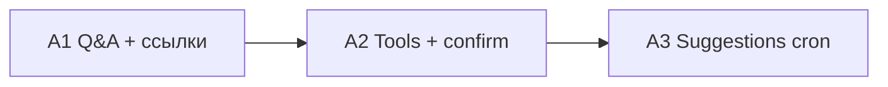
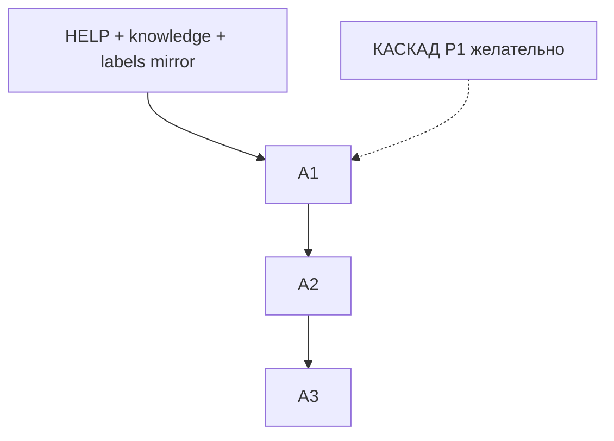

# План реализации: ИИ-ассистент продукта

> **Кодовое слово запуска: `АССИСТЕНТ`**
>
> | Команда | Что делаем |
> |---------|------------|
> | **`АССИСТЕНТ`** или **`АССИСТЕНТ A1`** | Q&A-помощник: UI + chat API + логи + system prompt |
> | **`АССИСТЕНТ A2`** | Tool-calling: whitelist + подтверждение + аудит |
> | **`АССИСТЕНТ A3`** | Проактивные предложения: cron + блок на Рабочем столе |
>
> Без **`АССИСТЕНТ`** — не трогаем код. Учёт: [`BACKLOG.md`](BACKLOG.md) → **B-ASSISTENT-001**.

**Статус:** план в бэклоге (2026-08-15), код не начат.  
**Стек:** FastAPI `/api/v1` + Next.js + RouterAI (OpenAI-совместимый, существующий клиент).  
**Связь:** **КАСКАД** (единый LLM-роутинг / `ai_usage_log`) — A1 желательно после или параллельно с **КАСКАД P1**, чтобы usage ассистента шёл через тот же слой.

---

## 0. Замечания к брифу и предложения

| Тема | Что учесть |
|------|------------|
| **HELP.md** | Файла **нет**. В A1 завести `v2/docs/HELP.md` (или `v2/docs/product/HELP.md`): как пользоваться разделами, термины = `labels.ts`. Без этого system prompt «описание продукта» будет дырявым. |
| **labels.ts на бэке** | Сейчас только фронт. Не кормить модель «сырым» фронтовым файлом из Docker-слоя web. Варианты: (a) зеркало `app/services/ui_labels.py` / JSON-снимок в репо; (b) эндпоинт `/api/v1/meta/labels` только для сборки prompt. Предпочтение: **зеркало в бэке** + комментарий «синхрон с labels.ts». |
| **ARCHITECTURE.md целиком** | Не класть весь файл в каждый запрос (токены, устаревание, лишние детали деплоя). A1: **кураторский** `assistant_knowledge.md` (~2–4k токенов) + ссылки «подробнее в docs»; ARCHITECTURE — источник правды при обновлении knowledge, не payload. |
| **Контекст страницы** | Фронт шлёт `pathname` + короткий `page_hint` (заголовок раздела). Не слать DOM / весь state — только whitelist полей (org id, роль, feature flags, 5–10 последних events). |
| **Streaming** | Сейчас `ai_json.py` ориентирован на JSON. Для чата нужен **отдельный** путь `chat_text_stream` (SSE), не ломая `chat_json`. Не тащить новый SDK — тот же `ai_base_url` + `routerai_api_key`. |
| **Клиентская зона `/c/`** | Публичная по токену. Ассистент **не** встраивать туда (или только статичный FAQ без org-данных). Иначе утечка тенанта через prompt. |
| **Cmd+K** | На Windows/Linux — **Ctrl+K**. Проверить конфликт с фокусом в инпутах (не перехватывать, если фокус в textarea/contenteditable). |
| **Tool = существующие API** | Правильно. Tools — тонкие обёртки: JWT пользователя, те же Depends/RBAC. Запрещено: «сервисный» обход прав. Опасные POST — только после `confirm_token`. |
| **Идемпотентность** | Бриф: whitelist только idempotent. Реально много полезных действий — не idempotent (сменить настройку, запустить job). Разделить: **safe_read** (без confirm) / **mutate** (confirm) / **forbidden**. |
| **Стоимость A3** | Cron + LLM на каждую org каждый день — дорого. Сначала **rule-based** предложения (SQL/счётчики), LLM только для формулировки 1 абзаца или вообще шаблоны без LLM на старте A3. |
| **PII / логи** | `assistant_messages` содержит имена кандидатов и настройки. Retention (например 90 дней), доступ только своей org + platform_owner. Не писать секреты (токены, webhook) в лог даже если пользователь вставил. |
| **Feature flag** | `ASSISTANT_ENABLED` (env или `app_settings`) — выключить без деплоя. |
| **Роли** | `platform_owner` > `hr_recruiter`: owner видит org-wide settings/integrations; recruiter — свои вакансии/кандидаты + help. Whitelist tools разный по роли. |
| **КАСКАД** | Task key `assistant_chat` / `assistant_suggest` в `task_map` (после P1). Не плодить второй счётчик токенов. |

### Предложения сверх брифа

1. **Режим «только справка»** для первых 1–2 недель продакшена (A1 без tools), даже если A2 уже в коде — флаг `assistant_tools_enabled`.
2. **Цитаты источников** в ответе: «по справке / по разделу Настройки → ИИ» — повышает доверие, меньше галлюцинаций.
3. **Ограничение длины диалога**: в LLM уходит последние N сообщений + summary старых (иначе раздувание контекста).
4. **Smoke**: отдельный блок в `SMOKE_TEST.md` (открыть drawer, один вопрос, проверить лог в БД; для A2 — dry-run confirm).
5. **Не отвечать за кандидата / заказчика** в смысле «напиши отказ клиенту» без явного tool — иначе ассистент станет теневым мессенджером.

---

## 1. Цель по уровням



| Фаза | Ценность | Оценка | Риск |
|------|----------|--------|------|
| **A1** | Онбординг, «где это в продукте», меньше эскалаций в поддержку | **5–7 чел·дн** | Утечка контекста / галлюцинации ссылок |
| **A2** | Действия без охоты по меню | **6–9 чел·дн** | Небезопасный tool / обход RBAC |
| **A3** | Утренний фокус на Рабочем столе | **4–6 чел·дн** | Шум, стоимость LLM |

**Итого:** ~15–22 чел·дн (без учёта полировки HELP и knowledge).

---

## 2. Архитектура эндпоинтов

| Метод | Путь | Фаза | Назначение |
|-------|------|------|------------|
| `POST` | `/api/v1/assistant/chat` | A1 | Диалог; **SSE stream** (`text/event-stream`) |
| `GET` | `/api/v1/assistant/tools` | A2 | Белый список доступных actions для роли |
| `POST` | `/api/v1/assistant/tools/execute` | A2 | Выполнить / запросить confirm |
| `POST` | `/api/v1/assistant/tools/confirm` | A2 | Подтвердить мутацию по `confirm_token` |
| `GET` | `/api/v1/assistant/suggestions` | A3 | Список предложений для org/user |
| `POST` | `/api/v1/assistant/suggestions/{id}/dismiss` | A3 | Скрыть / «сделано» |

**Auth:** JWT как у остальных `/api/v1/*`. Org из membership. Нет доступа из `/c/{token}`.

**Chat request (черновик):**
```json
{
  "message": "Где включить Telegram?",
  "thread_id": null,
  "page": { "path": "/settings/telegram", "title": "Telegram" },
  "client_context": { "locale": "ru" }
}
```

**Chat stream events:** `token` | `link` | `done` | `error` | (A2) `tool_proposal`.

---

## 3. Данные (миграции)

### A1 — `assistant_threads` + `assistant_messages`

- `assistant_threads`: `id`, `organization_id`, `user_id`, `created_at`, `updated_at`, `page_path` (опц.)
- `assistant_messages`: `id`, `thread_id`, `role` (`user`|`assistant`|`system`), `content`, `links_json`, `model`, `usage_json`, `created_at`

Индексы: `(organization_id, user_id, updated_at)`, `(thread_id, created_at)`.

### A2 — `assistant_actions`

- `id`, `organization_id`, `user_id`, `thread_id` (опц.), `tool_name`, `request_json`, `status` (`proposed`|`confirmed`|`executed`|`rejected`|`failed`), `result_json`, `confirm_token_hash`, `confirm_expires_at`, `created_at`, `executed_at`

### A3 — `assistant_suggestions`

- `id`, `organization_id`, `user_id` (null = на всю org), `kind` (enum/string), `title`, `body`, `href`, `priority`, `payload_json`, `status` (`active`|`dismissed`|`done`), `created_at`, `expires_at`

---

## 4. LLM-слой

| Компонент | Решение |
|-----------|---------|
| Клиент | Расширить существующий RouterAI-путь (`ai_base_url`, ключ); **не** новый пакет |
| System prompt | `assistant_knowledge.md` + роль/org snapshot + page + сжатые settings/events |
| Термины | Зеркало `labels` (RU) — модель не выдумывает «статус воронки» |
| Usage | Писать в `ai_usage_log` с task=`assistant_chat` (после КАСКАД P1) или временный счётчик в `usage_json` сообщения |
| Fallback | При 5xx/таймауте/refusе: короткий текст + **ручные шаги** со ссылками из whitelist маршрутов |
| Модель | Та же, что product AI / отдельный ключ в settings `assistant_model` (опц., default = общий) |

**Whitelist маршрутов UI** (для кликабельных ссылок): таблица path → title (из существующей навигации frontend), не свободная генерация URL.

---

## 5. Фаза A1 — Q&A-помощник

### 5.1 Backend

1. Миграции threads/messages.
2. Сервис `assistant_chat.py`: сбор контекста (org settings slice, last events, page), вызов stream.
3. Роут `POST /assistant/chat` → SSE.
4. Редактура `v2/docs/HELP.md` + `assistant_knowledge.md`.
5. Feature flag.

### 5.2 Frontend

1. Компонент `AssistantDrawer` (или модалка): история, input, stream rendering, кликабельные ссылки (`next/link`).
2. Кнопка «Помощник» в shell (все разделы под AuthGate, **не** `/c/`, **не** `/i/`).
3. Hotkey Cmd/Ctrl+K → открыть drawer; Esc → закрыть.
4. Передача `page.path` / title с текущего layout.

### 5.3 Гейт A1 → A2

- Диалог логируется; тенант не видит чужие threads.
- Ответы содержат только whitelist-ссылки (валидация на бэке перед отдачей в stream).
- Smoke: 1 вопрос + запись в БД.
- Нет tool-calling в проде, пока флаг tools выключен.

---

## 6. Фаза A2 — Tool-calling

### 6.1 Модель tools (примеры)

| Tool | Тип | Кто | Что делает |
|------|-----|-----|------------|
| `query_data` | safe_read | recruiter+ | Обёртки над существующими GET (вакансии, кандидаты, jobs) с лимитами |
| `change_setting` | mutate | по полю: owner / recruiter | PATCH существующих settings endpoints |
| `run_job` | mutate | recruiter+ | Старт существующих job endpoints (evaluate, sync…) |
| `explain_setting` | safe_read | все | Только чтение значения + help (без записи) |

`GET /assistant/tools` возвращает список **с учётом роли**.

### 6.2 Подтверждение

1. Модель предлагает tool → API пишет `assistant_actions` status=`proposed`, выдаёт `confirm_token` (TTL 5–10 мин).
2. UI: «Я собираюсь изменить X. Применить?»
3. `POST .../confirm` → сервер заново проверяет RBAC + whitelist → вызывает **тот же** внутренний сервис/HTTP-хендлер, что UI.
4. Отказ / истечение токена → `rejected`.

### 6.3 Гейт A2 → A3

- Аудит полный (кто/что/результат).
- Негативные тесты: recruiter не может owner-only setting; чужой org id в tool args отвергается.
- `assistant_tools_enabled` можно выключить.

---

## 7. Фаза A3 — Проактивные предложения

### 7.1 Сканер (ARQ cron)

Периодически (например 05:00 Europe/Moscow) по org:

| Триггер | Правило (без LLM сначала) |
|---------|---------------------------|
| Просроченные гарантии | Существующая логика warranty / dashboard |
| Неподключённые интеграции | Bitrix/Telegram/Calendar флаги |
| Зависшие кандидаты | `client_status=wait` дольше N дней / этап без движения |
| Вакансии без движения | Нет новых кандидатов / нет активности M дней |

Запись в `assistant_suggestions`. LLM (опц.) только для перефраза title/body.

### 7.2 UI

На `/dashboard` (Рабочий стол): блок «Сегодня стоит сделать» (до 3 пунктов) → deep link. Dismiss / Done.

### 7.3 Гейт done

- Предложения не дублируются ежедневно без изменения состояния.
- Нет предложений с данными чужой org.
- Можно отключить cron флагом.

---

## 8. Безопасность (сводка)

| Требование | Как |
|------------|-----|
| Тенантность | Все запросы через org membership; SQL всегда фильтр `organization_id` |
| Tools | Whitelist + роль + confirm на mutate |
| Секреты | Redact в логах; модель не должна запрашивать вставку токенов в chat history как «настройку» без UI |
| Публичные зоны | Нет ассистента на `/c/`, `/i/`, login |
| Rate limit | Лимит сообщений/час на user (защита от burn RouterAI) |

---

## 9. Порядок запуска и зависимости



| Зависимость | Зачем |
|-------------|-------|
| КАСКАД P1 (желательно) | Единый usage/routing |
| Зелёный smoke auth/settings | A2 дергает те же API |
| Dashboard metrics (частично есть) | A3 триггеры |

**Старт разработки:** только по команде **`АССИСТЕНТ A1`**.

---

## 10. Критерии приёмки (кратко)

**A1:** кнопка + hotkey; stream-ответ; ссылки кликабельны и валидны; логи в БД; чужая org недоступна.  
**A2:** read-tools без confirm; mutate только после confirm; аудит; RBAC.  
**A3:** ≤3 предложений утром; dismiss; триггеры из §7.1.

---

## 11. Вне scope (сознательно)

- Ассистент в Telegram-боте заказчика / клиентской зоне.
- Автономные действия без confirm (кроме чисто read).
- Голос / мультимодальность.
- Замена существующего `chat_json` для оценки резюме — ассистент **отдельный** product surface.
