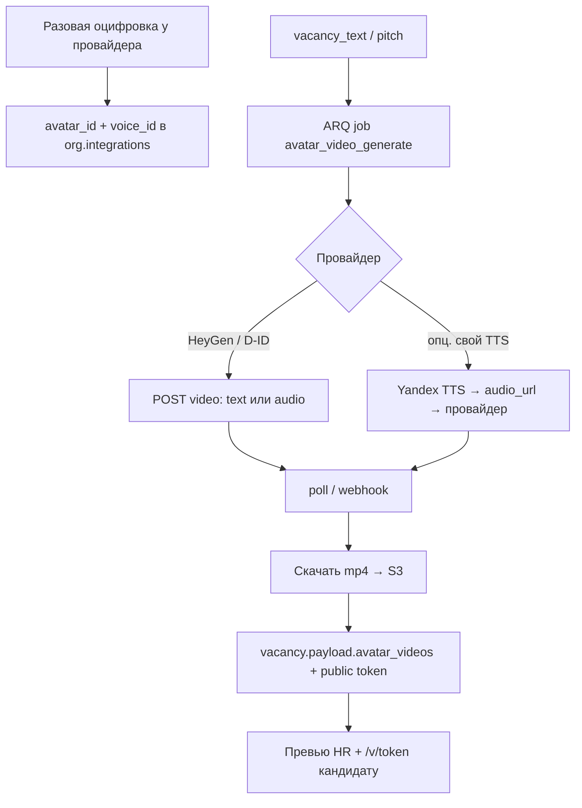

# План: сценарий видео-собеседования + аватар-видео

> **Кодовое слово: `ЭФИР`**
>
> | Команда | Что делаем |
> |---------|------------|
> | **`ЭФИР A`** или **`ОЧЕРЕДЬ Q-ЭФИР-A`** | Сценарий текста + телесуфлёр (фича А) |
> | **`ЭФИР B0`** | Выбор провайдера + пилот оцифровки (без прод-кнопки) |
> | **`ЭФИР B1`** | Job генерации mp4 + S3 + превью на вакансии |
> | **`ЭФИР B2`** | Публичная токен-ссылка для кандидата |
>
> Без **`ЭФИР`** — не трогаем. Учёт: QUEUE (A) + BACKLOG (B).

**Статус:** схема для обсуждения / бэклог · код после явной команды.  
**Связь:** документы D2/D3 (`document_generate.py`), опросник A1, SpeechKit (сейчас только **распознавание**), jobs J1–J4, публичные `/c/` `/i/`, КАСКАД (top-tier для сценария).

---

## 0. Оценка готовых решений А/Б

### Фича А — **принять почти как есть** (QUEUE, ~2–3 чел·дн)

| Плюс | Замечание / правка |
|------|-------------------|
| Новый ключ документа рядом с `profile` / `vacancy_text` | ✅ `GENERATABLE_KEYS` + `DocumentsEditor` |
| Вход: профиль + опросник + формат 10/20/30 | ✅; **уточнить**: сценарий на **вакансию** (из `documents.questions`) или на **карточку кандидата** (из `interview_questionnaire`). Рекомендация: **оба режима** — «общий» на вакансии + «под кандидата» в карточке |
| Тайминг + follow-up | ✅ строгий JSON-схема (как КАСКАД) |
| Телесуфлёр — чистый фронт | ✅ отдельный route, копеечно |
| Оценка «1–2 дня» | Чуть занижена: schema + job + суфлёр + smoke ≈ **2–3 дня** |
| КАСКАД top | ✅ task `video_interview_script` → tier **top** |
| Бонус «сценарий → запись → покрытие блоков» | Отложить в **ЭФИР C** (после стабильного транскрипта + digest) |

### Фича Б — **принять как отдельный модуль** (BACKLOG), не в ближайшую очередь

| Плюс | Замечание / правка |
|------|-------------------|
| Текст уже есть (`vacancy_text`) | ✅ не генерировать заново без нужды |
| Job + S3 + прогресс | ✅ паттерн как `transcribe_media` |
| Публичная ссылка как `/i/` | ✅ `/v/[token]` или `/vacancy-video/[token]` |
| «SpeechKit TTS = та же услуга» | **Неточно:** сейчас в коде только **STT** (распознавание). TTS — **другой** API Яндекса (или TTS провайдера аватара). Не смешивать с `transcription.py` |
| HeyGen vs D-ID | Выбор в **B0**, не в коде: оплата из РФ, качество, instant avatar |
| Дипфейк / этика | Обязательно: согласие HR, пометка «синтетическое видео» для кандидата, feature flag, не в client zone без явного opt-in |
| Оценка | B0 1–2 дн · B1 5–8 · B2 2–3 ≈ **8–13 чел·дн** + стоимость API |

---

## 1. Фича А — сценарий видео-собеседования

### 1.1 Продукт

Кнопка **«Сценарий видео»** → структурированный текст для чтения на камеру:

1. Хук / приветствие (~30 сек)  
2. О компании / вакансии (1–2 мин)  
3. Блоки вопросов из опросника с таймингом и follow-up  
4. Пауза «ваши вопросы»  
5. Финал: следующие шаги и срок ОС  

Формат длительности: **10 / 20 / 30 минут** (пересчёт бюджета времени на блоки).

Режим **телесуфлёр:** крупный текст, автоскролл, пауза/скорость.

### 1.2 Данные

**Хранение (вакансия):**
```json
// vacancy.documents.video_script
{
  "format_minutes": 20,
  "generated_at": "ISO",
  "source": "vacancy_questions|candidate_questionnaire",
  "candidate_id": null,
  "blocks": [
    {
      "id": "hook",
      "title": "Приветствие",
      "duration_sec": 30,
      "script": "…",
      "followups": []
    },
    {
      "id": "q1",
      "title": "Опыт с маркетплейсами",
      "duration_sec": 180,
      "script": "…",
      "followups": ["Если ответ короткий — спросить про конкретный кейс"]
    }
  ],
  "teleprompter_plain": "плоский текст для суфлёра (опционально)"
}
```

**Альтернатива на кандидате:** `candidate.payload.video_script` — тот же schema, `source=candidate_questionnaire`.

### 1.3 Backend

| Что | Детали |
|-----|--------|
| Ключ | `video_script` в `GENERATABLE_KEYS` (+ отдельный endpoint если нужен `format_minutes`) |
| Prompt | новый system в `document_generate.py` или `video_script.py` |
| Вход | `profile` + `questions` / questionnaire JSON + `format_minutes` |
| Выход | валидируемый JSON (Pydantic) |
| Job | reuse `vacancy_docs_*` или новый `vacancy_video_script` (ARQ, прогресс) |
| КАСКАД | `task_map.video_interview_script = "top"` |

**API (черновик):**

```
POST /api/v1/vacancies/{id}/documents/video-script
  { "format_minutes": 20, "mode": "generate"|"regenerate", "correction": "" }
  → 202 { job_id }

POST /api/v1/candidates/{id}/video-script
  { "format_minutes": 20 }
  → 202 { job_id }

GET  /api/v1/vacancies/{id}/documents/video-script
GET  /api/v1/candidates/{id}/video-script
```

### 1.4 Frontend

- `DocumentsEditor` / блок на вакансии: кнопка + preview блоков  
- Карточка кандидата: «Сценарий под этого кандидата»  
- **`/vacancies/[id]/teleprompter`** или `/candidates/[id]/teleprompter`**:
  - крупный шрифт, тёмный фон, автоскролл
  - controls: скорость, пауза, «следующий блок»
  - без cards/dashboard — один экран «читать»

### 1.5 ЭФИР C (позже) — покрытие сценария после эфира

Запись → существующий транскрипт → ИИ сверяет `blocks[].id` с transcript → чеклист «не закрыли блок X».  
Зависимость: стабильный `interview_process` + КАСКАД P2. Не в MVP А.

### 1.6 Оценка А

| Кусок | Дни |
|-------|-----|
| Prompt + schema + generate/store | 1 |
| UI кнопка + preview | 0.5–1 |
| Телесуфлёр | 0.5–1 |
| Smoke | 0.5 |
| **Итого** | **2–3** |

---

## 2. Фича Б — аватар-видео (цифровой двойник)

### 2.1 Цель

Кнопка на вакансии: **«Видео с моим аватаром»** → mp4, где ваш аватар озвучивает **описание вакансии** (`documents.vacancy_text` или укороченный «pitch» ≤ N символов). Ссылка кандидату вместо длинного текста.

### 2.2 Архитектура (механизм)



### 2.3 Разовая оцифровка (B0, вне прод-кнопки)

1. Гайдлайн: 2–5 мин видео (свет, анфас, естественная речь).  
2. Загрузка в кабинет провайдера (или их upload API).  
3. Получить `avatar_id`, `voice_id`.  
4. Сохранить в `organizations.integrations.avatar_video`:

```json
{
  "provider": "heygen|did",
  "enabled": false,
  "avatar_id": "",
  "voice_id": "",
  "default_aspect": "16:9",
  "max_chars": 2500,
  "disclose_synthetic": true
}
```

Feature flag: `integrations.features.avatar_video = false` до пилота.

### 2.4 Генерация по запросу (B1)

**Job `avatar_video_generate`:**

1. Взять текст: `vacancy_text` или поле `avatar_pitch` (если длиннее `max_chars` — ИИ-сжатие на **fast** или обрезка с warning).  
2. Вызов провайдера: `POST /videos` → `video_id`.  
3. Poll / webhook → download URL.  
4. Скачать → upload в Object Storage (тот же S3-паттерн, что SpeechKit PCM, но **хранить** mp4).  
5. Записать в `vacancy.payload.avatar_videos[]`:

```json
{
  "id": "uuid",
  "s3_key": "…",
  "public_token": "…",
  "provider_video_id": "…",
  "source_doc": "vacancy_text",
  "chars": 1200,
  "created_at": "ISO",
  "status": "ready|failed"
}
```

**Progress labels (J1–J4):** «Готовим текст» → «Запрос к провайдеру» → «Рендер» → «Загрузка в хранилище».

### 2.5 Публичная выдача (B2)

- Route: **`/v/[token]`** (по аналогии `/i/[token]`) — только видео + короткая подпись вакансии + дисклеймер «синтетическое видео».  
- Без логина.  
- Токен в `payload`, revoke = удалить запись / ротация токена.

### 2.6 Выбор провайдера (B0)

| | HeyGen | D-ID |
|--|--------|------|
| Качество двойника | Выше | Ниже |
| Instant avatar | ~5 мин | фото/короткое видео |
| Русский голос | Да (клон / stock) | Ограниченнее |
| Оплата из РФ | Сложнее (посредник / карта) | Аналогично часто |
| API зрелость | Высокая | Проще, дешевле |

**Рекомендация плана:** абстракция `AvatarVideoProvider` (interface) + одна реализация в пилоте; второй провайдер — адаптер без смены UI.

**TTS:** предпочтительно **клон голоса у провайдера аватара** (синхрон губ проще). Yandex TTS — запасной путь, если провайдер принимает `audio_url`.

### 2.7 Риски Б

| Риск | Митигация |
|------|-----------|
| Этичность / доверие кандидата | Дисклеймер на `/v/`; настройка `disclose_synthetic` |
| Стоимость рендера | Лимит chars; 1 активное видео на вакансию; confirm в UI |
| Оплата / блокировки API | B0 пилот на 1 org; ключи в `.env` + org integrations |
| Долгий render | Job + SSE toast (как segment copy) |
| Утечка avatar_id | Только platform_owner меняет integrations |
| Путаница SpeechKit STT/TTS | Разные модули: `transcription.py` vs `avatar_tts.py` |

### 2.8 Оценка Б

| Фаза | Дни |
|------|-----|
| B0 провайдер + оцифровка + integrations | 1–2 |
| B1 job + S3 + UI кнопка | 5–8 |
| B2 публичная страница | 2–3 |
| **Итого** | **8–13** |

---

## 3. Порядок внедрения

```
ЭФИР A (QUEUE, 2–3 дн)     — можно после/параллельно КАСКАД P1 (task key)
    ↓ (опционально)
ЭФИР C покрытие сценария   — после КАСКАД P2 + стабильный транскрипт
    ↓
ЭФИР B0 → B1 → B2          — отдельный модуль, feature flag
```

**Не блокирует** ЯКОРЬ / КАСКАД P2 (кроме добавления `video_interview_script` в `task_map` КАСКАД).

---

## 4. КАСКАД — дополнение task_map

```json
"video_interview_script": "top",
"avatar_pitch_compress": "fast"
```

Добавить в `IMPLEMENTATION_PLAN_KASKAD.md` при старте ЭФИР A / B1.

---

## 5. Smoke (черновик)

| ID | Сценарий |
|----|----------|
| E-A.1 | Генерация сценария 20 мин на вакансии → blocks с суммой ≈ 20×60 сек |
| E-A.2 | Телесуфлёр открывается, скролл работает |
| E-A.3 | Сценарий под кандидата использует его опросник |
| E-B.1 | (flag on) Job → mp4 в S3 → превью |
| E-B.2 | `/v/token` без логина показывает видео + дисклеймер |

---

## 6. НЕ делаем в MVP

- Автопубликация аватара в Telegram без подтверждения HR  
- Генерация аватара «из фото HH кандидата» (только HR-двойник)  
- Замена живого собеседования аватаром  
- Смешение STT SpeechKit и TTS в одном модуле  
- ЭФИР C до стабильного interview pipeline  

---

## 7. Сводка для QUEUE / BACKLOG

| ID | Куда | Суть |
|----|------|------|
| **Q-ЭФИР-A** | QUEUE | Сценарий + телесуфлёр |
| **B-EFIR-001** | BACKLOG | Аватар-видео B0–B2 |
| **B-EFIR-002** | BACKLOG | ЭФИР C — покрытие сценария после записи |

---

*Документ: 2026-08-16 · Кодовое слово: **ЭФИР***
